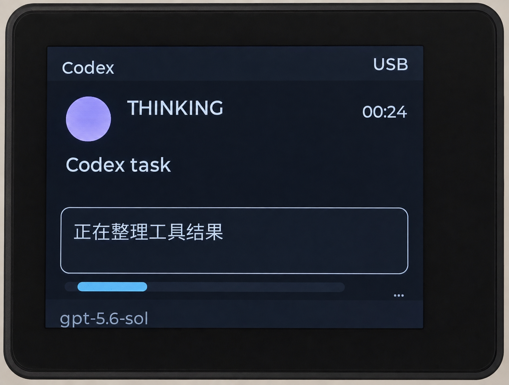
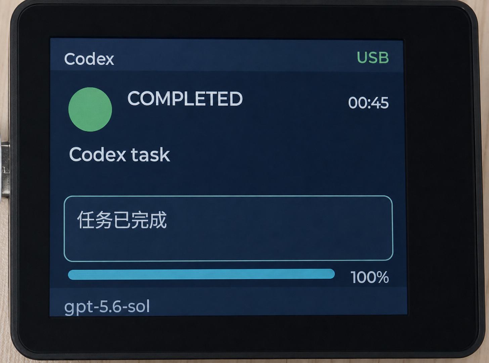

# Saki

Saki 是一块放在桌面上的 AI Agent 状态屏。它由 ESP32-S3 设备和 macOS 伴随程序组成，
把 Codex 等 Agent 的工作状态同步到独立屏幕，让你不切换窗口也能看到任务正在思考、执行、
等待操作，还是已经完成。

当前版本为 **0.4.5**（日常固件报告 **0.4.5-dev**）：支持 Codex / Claude Code 多 Session，Host 最多跟踪 32 项、
设备以最新提交主屏及其他 Session 侧栏最多显示 4 项。核心代码、离线检查和固件构建已通过；0.4 的真机混合并发、触摸、
USB/BLE 切换与资源验收尚未完成。范围见 [0.4 规格](./docs/versions/0.4.0/SPEC.md)，
安装见 [0.4 用户指南](./docs/versions/0.4.0/USER_GUIDE.md)。目标硬件为正点原子
ATK-DNESP32S3B3 / ESP32S3 BOX3，320×240 横屏。
## 实机效果

| 正在思考 | 任务完成 |
| --- | --- |
|  |  |

## 主要能力

- Codex / Claude Code 多 Session 独立计时、最新提交主屏与状态侧栏、脱敏身份和恢复。

- 展示启动、思考、执行、等待用户、等待批准、完成、失败、取消和空闲状态。
- 显示中英文任务标题、动作摘要、活动类型、执行时间和确定/未知进度。
- 执行时间由设备持续更新，新事件到达时自动校准；未知进度使用平滑循环动画。
- 支持触摸切换摘要与详情、自动返回、暗屏唤醒和断线状态提示。
- 自动发现 USB 设备，并处理握手、ACK/重试、心跳、热插拔和会话恢复。
- 可选支持 BLE：K2 本地配对授权、加密绑定、USB 优先自动切换和手动暂停重连。
- Agent 事件在 Mac 上归一化和脱敏，不向设备发送隐藏思维链或完整工具输出。
- 内置常用简体中文字库，任务标题和固定文案可直接显示中文。

## 工作方式

```text
Codex / Claude Code lifecycle hooks
        │  本地 Unix Domain Socket
        ▼
saki-host on macOS ── USB CDC / BLE GATT + NDJSON ── ESP32-S3 firmware ── LCD
```

Mac Host 负责采集事件、脱敏、状态合并、设备发现和连接恢复；设备固件负责协议校验、状态
模型、计时、动画、触摸和界面渲染。协议传输的是与角色无关的语义状态，因此后续可以在
设备端加入不同形象或主题，而不必修改 Agent adapter。

## Quick Start

### 1. 准备环境

需要 macOS、Python 3.12、ESP-IDF 5.5.3、目标开发板和一根支持数据传输的 USB 线。

```zsh
git clone https://github.com/mgbaozi/saki.git
cd saki

python3.12 -m venv host/.venv
host/.venv/bin/pip install -e 'host[dev]'
```

需要开发和验证 BLE 时安装可选依赖：

```zsh
host/.venv/bin/pip install -e 'host[dev,ble]'
```

构建脚本会从仓库布局推导 ESP-IDF 路径；如果 IDF 安装在其他位置，先设置：

```zsh
export SAKI_IDF_PATH=/path/to/esp-idf-v5.5.3
```

### 2. 构建固件

```zsh
scripts/build-firmware.zsh
```

这会生成日常开发固件。构建不需要连接设备。

### 3. 烧录设备

1. 按住 `K0`。
2. 短按 `RST`，等待约一秒后松开 `K0`。
3. 确认新出现的 `/dev/cu.usbmodem*` 端口，并把实际端口传给烧录脚本：

```zsh
scripts/flash-firmware.zsh /dev/cu.usbmodemXXXXXX dev
```

烧录完成后，不按 `K0`，短按一次 `RST` 启动应用。端口名会随重新枚举变化，不要把真实
端口永久写入配置。

### 4. 启动 Mac Host

先确认设备可以被发现并完成握手：

```zsh
host/.venv/bin/saki-host serial list
host/.venv/bin/saki-host doctor
```

然后安装用户级常驻服务：

```zsh
scripts/saki-service.zsh install
scripts/saki-service.zsh status
```

在 Codex 中打开本项目，并在首次提示时信任 `.codex/hooks.json`。之后 Agent 生命周期事件
会通过本地 Host 自动同步到屏幕。

## 常用命令

```zsh
# 运行 Host、协议和文档检查
scripts/check.zsh

# 查看或维护常驻服务
scripts/saki-service.zsh status
scripts/saki-service.zsh logs
scripts/saki-service.zsh restart
scripts/saki-service.zsh uninstall

# 构建 release profile 或固件测试镜像
scripts/build-firmware-profile.zsh release
scripts/build-firmware-tests.zsh
```

需要独占串口进行手工发送、回放或测试时，先停止常驻服务，完成后再启动。详细命令和故障
排查见[0.3.0 用户指南](./docs/versions/0.3.0/USER_GUIDE.md)。

## 项目结构

- `firmware/`：ESP-IDF + LVGL 设备固件。
- `host/`：运行在 macOS 上的 Python 伴随程序。
- `protocol/`：Host 与固件共享的 NDJSON Schema 和脱敏测试 fixture。
- `scripts/`：环境、构建、烧录、测试和 LaunchAgent 管理入口。
- `docs/`：规格、工程设计、任务记录、发布说明和路线图。

## 文档

- [文档索引](./docs/README.md)
- [0.3.0 产品与通信规格](./docs/versions/0.3.0/SPEC.md)
- [0.3.0 工程实施设计](./docs/versions/0.3.0/IMPLEMENTATION.md)
- [0.3.0 实施任务与验证记录](./docs/versions/0.3.0/TASKS.md)
- [0.3.0 用户安装与排障指南](./docs/versions/0.3.0/USER_GUIDE.md)
- [0.4.0 Codex / Claude Code 多 Session 规格](./docs/versions/0.4.0/SPEC.md)
- [0.4.5 Claude Code hook 支持规划](./docs/versions/0.4.5/SPEC.md)
- [0.4.5 发布说明](./docs/releases/0.4.5.md)
- [0.2.0 已发布文档](./docs/versions/0.2.0/SPEC.md)
- [后续路线图](./docs/ROADMAP.md)

## 许可证与项目名称

Saki 的原创代码和文档使用 [Apache License 2.0](./LICENSE)，归属及第三方声明见
[NOTICE](./NOTICE)。第三方组件继续适用各自的许可证和版权声明。

可以依照许可证使用、修改和分发本项目及衍生作品，但衍生项目、产品、服务或发行版不得
继续以 `Saki` 命名，也不得暗示获得原项目或作者背书。为说明代码来源和保留归属信息，
仍可合理引用 “Saki”；分发时必须保留适用的 `LICENSE`、`NOTICE`、原项目和作者信息。
