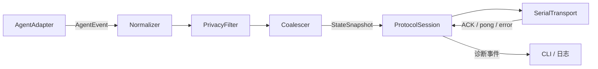
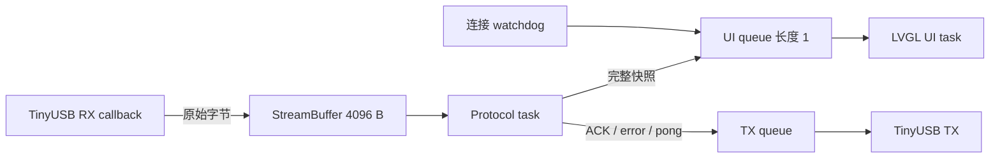

# Saki 工程实施设计

> 文档版本：0.2.0
> 状态：Release candidate
> 关联规格：[SPEC.md](./SPEC.md)
> 执行清单：[TASKS.md](./TASKS.md)

## 1. 文档目的

本文把产品与协议规格落实为可执行的工程方案，明确：

- 仓库目录和模块职责；
- 哪些逻辑运行在 Mac，哪些逻辑运行在 ESP32 固件；
- 两端如何并发、排队和交换状态；
- 如何建立、构建、烧录、测试和调试项目；
- 每个实施阶段的输入、产出和完成标准。

协议字段、UI 状态和验收行为以 [SPEC.md](./SPEC.md) 为准。本文出现冲突时，应先修改规格，再修改实现。

## 2. 总体技术选择

| 层面 | 第一版选择 | 原因 |
| --- | --- | --- |
| 固件框架 | ESP-IDF 5.5.3 + FreeRTOS | 与设备资料和厂家示例一致 |
| UI | LVGL 8.4.0 | 厂家已完成 ST7789 和 CHSC5432 移植 |
| 有线传输 | TinyUSB CDC ACM | Mac 无需专用驱动，可双向传输 |
| 应用协议 | UTF-8 NDJSON | 易调试、易跨 USB/BLE/TCP 复用 |
| 固件 JSON | ESP-IDF 内置 cJSON | 不增加新的 JSON 依赖 |
| Mac 运行时 | Python 3.12 | 本机已有环境，迭代快，支持串口和未来 BLE |
| Mac 串口库 | pyserial 3.x | 支持 macOS CDC 发现、读写和 DTR |
| Mac 并发 | asyncio + 有界队列 | 适合事件源、串口收发、ACK 和心跳并行 |
| Host 测试 | pytest | 适合协议、状态映射和模拟串口测试 |
| 固件测试 | ESP-IDF Unity + 真机协议回放 | 覆盖 C 解析器和硬件集成 |

Mac 第一版运行时只要求 Python 和 pyserial。数据模型使用标准库 `dataclasses`，CLI 使用 `argparse`，避免为基础功能引入大型框架。`pytest`、`ruff` 等只属于开发依赖。

## 3. 项目结构

`0.2.0` 的实际目录职责如下；生成目录和本机 validation 产物不提交。

```text
saki/
├── README.md
├── .gitignore
├── docs/
│   ├── README.md
│   ├── ROADMAP.md
│   ├── releases/0.2.0.md
│   └── versions/0.2.0/
│       ├── SPEC.md
│       ├── IMPLEMENTATION.md
│       ├── TASKS.md
│       └── USER_GUIDE.md
├── protocol/
│   ├── README.md
│   ├── schema/v1/
│   └── fixtures/v1/
├── firmware/
│   ├── CMakeLists.txt
│   ├── sdkconfig.defaults
│   ├── dependencies.lock
│   ├── partitions-16MiB.csv
│   ├── config/{sdkconfig.vendor,sdkconfig.dev,sdkconfig.release}
│   ├── main/
│   ├── components/
│   │   ├── vendor_box3_bsp/
│   │   ├── saki_model/
│   │   ├── saki_protocol/
│   │   ├── saki_ui/
│   │   ├── saki_ui_policy/
│   │   └── saki_usb/
│   └── test_app/
├── host/
│   ├── README.md
│   ├── pyproject.toml
│   ├── src/saki_host/
│   └── tests/
├── scripts/
├── .codex/hooks.json
└── artifacts/
    └── .gitkeep
```

### 3.1 根目录与项目文档

- `README.md`：项目入口和常用操作。
- `docs/versions/0.2.0/`：本版本规格、设计、任务和用户指南。
- `docs/releases/0.2.0.md`：本版本能力、验证摘要、限制和发布阻塞项。
- `docs/ROADMAP.md`：尚未纳入正式版本的 BLE、Wi-Fi 与增强任务。
- `protocol/`：跨语言协议的可执行契约。JSON Schema 主要用于 Host 测试和文档校验，固件不在运行时加载 Schema。
- `scripts/`：把容易出错的环境初始化、构建和烧录命令固化下来。
- `artifacts/`：本地生成的固件、尺寸报告和测试日志；除 `.gitkeep` 外默认不提交。

`firmware/config/sdkconfig.vendor` 是厂家已验证配置的只读快照。基线阶段可以暂时以根目录 `sdkconfig` 直接构建；完成 defaults 迁移后，根目录 `sdkconfig` 不再提交，dev/release 各自在自己的 build 目录生成配置。

### 3.2 厂家 BSP 的处理

`vendor_box3_bsp` 从厂家 LVGL 示例中提取，只包含本项目使用的 I²C、SPI、AW9523B、LCD 和触摸驱动。

- 保留原文件版权头。
- 在 `ORIGIN.md` 记录来源路径、拷贝日期和做过的修改。
- 第一轮硬件点亮前不重写驱动，只做必要的目录、命名和 CMake 整理。
- I²C 和 SPI 只能由 BSP 初始化一次；UI 和触摸共享已有总线。
- 厂家原始示例目录保持只读，不直接构建出产物到原目录。

## 4. Mac 与固件的代码边界

### 4.1 职责矩阵

| 能力 | Mac 伴随程序 | ESP32 固件 |
| --- | --- | --- |
| 读取 Agent 原始事件 | 负责 | 不包含 |
| Agent 特定 API、凭据和登录状态 | 负责并保留在 Mac | 不接收、不存储 |
| 原始事件到统一状态的映射 | 负责 | 只验证结果 |
| 隐私过滤和高层摘要 | 负责 | 做长度和类型防御 |
| 状态更新合并与限速 | 负责 | 队列满时保留最新快照 |
| 串口发现、打开和重连 | 负责 | 响应 DTR、握手和字节流 |
| 协议编码 | 负责 | 负责回复消息编码 |
| 协议解析 | 负责解析回复 | 负责解析 Host 消息 |
| ACK 超时和重发 | 负责 | 负责生成 ACK |
| 心跳 | 主动发送 `ping` | 回复 `pong` 并检测超时 |
| 任务耗时基准 | 负责产生 `elapsed_ms` | 活动状态下本地继续计时 |
| 屏幕状态和动画 | 不包含 | 负责 |
| LCD、触摸和屏幕视觉亮度 | 不包含 | 负责 |
| 断线旧状态覆盖层 | 不包含 | 负责 |
| 配置和诊断 CLI | 负责 | 提供有限能力和错误回复 |

### 4.2 明确禁止跨边界的内容

设备固件中不放置：

- Agent 服务的 API Key、Cookie、OAuth Token 或用户凭据；
- 完整任务历史、完整对话或隐藏思维链；
- Agent SDK、Git 操作或 Mac 文件系统访问逻辑；
- Mac 的固定串口设备名；
- Wi-Fi 密码的编译时常量。

Mac 伴随程序中不复制：

- LCD 坐标和 LVGL 控件状态机；
- AW9523B、ST7789、CHSC5432 或其他板级寄存器逻辑；
- 依赖设备本地 tick 的动画、详情超时和亮度定时器。

### 4.3 Mac 进程数据流



建议的异步任务：

1. `adapter_task`：读取 Agent 事件并写入有界事件队列。
2. `state_task`：归一化、隐私过滤、生成完整状态快照并合并高频更新。
3. `connection_task`：扫描串口、握手、重连和维护当前 Transport。
4. `tx_task`：串行发送消息并维护待 ACK 表。
5. `rx_task`：按行读取、解析 ACK/pong/error。
6. `heartbeat_task`：每 5 秒发送 ping，并驱动连接超时。

所有队列必须有上限。事件积压时保留最新语义状态，不尝试逐条重放已经过时的“正在读取/正在编辑”事件。

pyserial 在 macOS 上使用阻塞文件 API。第一版通过专用读写工作线程或 `asyncio.to_thread()` 承载阻塞调用，再把结果送回 asyncio 队列；不能在 event loop 线程直接执行无超时的 `read()`。因此运行时仍只需要 pyserial，不额外依赖 pyserial-asyncio。

### 4.4 固件数据流



实现规则：

- TinyUSB 回调只复制字节和更新连接标志，不解析 JSON、不分配大型对象、不调用 LVGL。
- RX 使用 4096 字节 StreamBuffer；单帧工作缓冲区为 2049 字节。
- 协议任务拥有 cJSON 解析对象，验证成功后拷贝到固定大小的 `saki_state_snapshot_t`，随后释放 cJSON。
- UI 队列长度为 1，使用覆盖语义：如果 UI 尚未消费旧快照，保留更新的完整快照。
- TX 队列保存 ACK、pong 和 error，长度初始为 8；队列满时优先保留握手和 ACK。
- 所有 LVGL 控件只能由 UI 任务创建和修改。
- 字符串存储采用固定上限或一次性状态缓冲区，不根据远端长度无限分配。

### 4.5 固件任务建议

初始值以厂家 LVGL 示例可稳定运行作为前提，完成真机 profiling 后再调整：

| 任务 | 初始优先级 | 初始栈 | 说明 |
| --- | ---: | ---: | --- |
| LVGL UI | 5 | 10 KiB | 调用 `lv_timer_handler`，周期约 10 ms |
| USB/Protocol worker | 5 | 10 KiB | 当前第一版合并执行分帧、cJSON、校验、状态入队和 TX；真机发现 4 KiB 会在首个 status 后栈溢出复位 |
| Watchdog | 3 | 3 KiB | 心跳超时、背光和连接状态定时 |

第一版先不绑定 CPU Core。只有 profiling 证明任务互相干扰后才固定 Core，并在文档中记录理由。

真机记录（2026-09-02）：USB callback 只向 4096 B StreamBuffer 写入；10 KiB worker 连续完成 hello、5 个 status/ACK 和 ping/pong。后续仍需用 stack watermark 决定是否把协议和 TX 拆为独立任务。

## 5. 固件模块设计

### 5.1 `app_main`

启动顺序固定为：

1. 初始化 NVS；仅在明确的版本/空间错误时擦除并重试。
2. 初始化 BSP 总线、AW9523B、LCD 背光使能、LCD 和触摸。
3. 初始化 LVGL、显示缓冲、输入设备和 tick。
4. 创建 UI，显示启动/等待连接页。
5. 初始化状态模型、队列和协议任务。
6. 初始化 TinyUSB CDC。
7. 启动连接 watchdog。

如果 LCD 初始化失败，仍保留可用的诊断输出；如果 USB 初始化失败，UI 显示错误而不是无限重启。

### 5.2 `saki_model`

提供与协议字段对应、与 LVGL 解耦的 C 结构：

- 主状态枚举；
- task、activity、progress、agent 子结构；
- `elapsed_ms` 和本地单调时钟接收基准；活动状态使用二者计算当前耗时，Host 新快照替换基准，终态和断线快照冻结；
- `session`、`seq` 和连接新鲜度；
- UTF-8 安全复制、清空和完整替换函数。

UI 只能读取这一模型，不读取 cJSON 对象。

### 5.3 `saki_protocol`

负责：

- 按 `\n` 分帧和 CRLF 兼容；
- 2048 字节上限及超长帧恢复；
- JSON 类型、必需字段、枚举和长度验证；
- 握手状态机；
- `status`、`clear`、`ping`；
- ACK、pong 和 error 编码；
- 同一 session 的 seq 去重和乱序拒绝。

不负责：

- USB 设备生命周期；
- UI 文案、颜色或动画；
- Agent 原始事件映射。

### 5.4 `saki_transport`

定义传输无关接口，第一版即使用该接口，避免把协议直接写死在 TinyUSB 回调中：

```c
typedef struct {
    esp_err_t (*start)(void *ctx);
    esp_err_t (*stop)(void *ctx);
    bool (*is_connected)(void *ctx);
    int (*read)(void *ctx, uint8_t *buf, size_t len, TickType_t timeout);
    int (*write)(void *ctx, const uint8_t *buf, size_t len, TickType_t timeout);
    const char *name;
    void *ctx;
} saki_transport_t;
```

具体签名在实现时可以按 ESP-IDF API 调整，但协议层只能依赖这一抽象，不直接 include TinyUSB、NimBLE 或 lwIP 头文件。

### 5.5 `saki_transport_usb`

- 安装 TinyUSB device driver 和一个 CDC ACM 接口。
- 设置产品名 `Saki Agent Display`，序列号由 eFuse MAC 生成。
- DTR 建立时清空旧 RX 半帧并通知协议层开始握手。
- DTR 断开时停止发送、清空当前握手状态并触发断线计时。
- USB worker 在自己的任务上下文中轮询协议活动 deadline；握手后 15 秒没有通过会话校验的 status、clear 或 ping 时，重置 handshake/session/seq/半帧状态并发布离线快照。该路径与 RX、DTR 回调串行执行，不从定时器并发修改协议引擎。
- 离线快照保留最后一次成功提交的任务、动作、进度和耗时，仅把 `connected=false`、transport 改为 `OFFLINE`；恢复后必须由新 hello 后的完整 status 替换。
- 不把 `ESP_LOG` 或 `printf` 重定向到业务 CDC。

### 5.6 `saki_ui_policy`

这是不依赖 LVGL 和板级驱动的纯状态机，负责：

- 根据活动、空闲和断线时长选择 80%、35% 或 20% 的视觉亮度；
- 暗屏第一次触摸只恢复正常亮度，不继续触发详情切换；
- 亮屏时，仅任务/动作区域的触摸可以切换摘要与详情；
- 详情打开 15 秒后自动关闭；
- 新快照恢复正常亮度；新快照不再包含 detail 时，同时关闭详情。

策略接受单调毫秒时钟并返回“亮度变化/详情变化”位标志。它不直接调用 LVGL、I²C
或触摸驱动，因此相同边界条件可在 Unity test app 中确定性验证。

### 5.7 `saki_ui`

- 只接收完整 `saki_state_snapshot_t` 和本地连接事件。
- 主页面控件只创建一次，后续通过 diff 更新属性。
- 页面切换、动画、视觉亮度和触摸详情属于本地行为。
- UI 任务比较当前耗时的整秒值，只在秒数变化时更新右上角标签；不为计时重建页面，也不从定时器并发调用 LVGL。
- UI 任务直接读取厂家 CHSC5xxx 坐标，在手指释放时把一次 tap 交给
  `saki_ui_policy`；这样触摸行为不受顶层遮罩或 LVGL 控件的事件捕获顺序影响。
- 详情视图隐藏任务标题，把动作卡扩展到 106 px 高并显示 `DETAIL` 与 detail 文本；再次
  点击或 15 秒超时恢复摘要。
- 亮度百分比经 `saki_ui_policy_dimming_opacity()` 转换为全屏黑色遮罩透明度，并始终置于
  最顶层。80%、35%、20% 分别对应约 20%、65%、80% 黑色遮罩。
- UI 文案集中定义，避免业务代码散落中文字符串。
- 状态色、间距和字号集中在 theme 文件。
- 图标优先使用 LVGL symbol 或项目内单色资源，避免大体积位图。

ATK-DNESP32S3B3 的 `LCD_BL` 经 AW9523B P1.0 接入，但板级电路把它用作低有效使能，
不是 LED 电流/PWM 调光通路。把 P1.0 切到 AW9523B constant-current DIM 模式后，任何非零
值都会让面板保持全亮，不能得到稳定的多级背光。因此 0.2.0 保留厂家验证过的 GPIO
使能方式，用 LVGL 遮罩实现可见的亮度级别。该方案不会降低背光电功耗；真正节能的硬件
调光留待确认额外电路能力或硬件改版后实现。

### 5.8 分区与资源

0.2.0 使用 16 MiB Flash 与 1,984 KiB factory app 分区：

```text
nvs       0x009000  0x006000
phy_init  0x00f000  0x001000
factory   0x010000  0x1f0000
vfs       0x200000  0xa00000
storage   0xc00000  0x400000
```

release app 为 923,648 bytes，factory 分区仍有 1,107,968 bytes（55%）余量，因此首版无需
扩大 app 分区。0.2.0 无 OTA 分区；未来加入 OTA 时必须单独设计数据迁移和回滚策略。

## 6. Mac 伴随程序设计

### 6.1 包与入口

Host 安装后提供 `saki-host` 命令：

```text
saki-host doctor
saki-host serial list
saki-host serial cycle --count 3 --interval 0.1
saki-host serial soak --count 10000 --duration 86400 --report artifacts/soak-24h.json
saki-host serial fuzz --count 40 --seed 20260903
saki-host send --state working --title "测试任务"
saki-host replay path/to/session.ndjson
saki-host serve
```

- `doctor`：检查 Python、依赖、可见串口和握手结果。
- `serial list`：列出候选串口及 USB 描述信息。
- `serial cycle`：重复独占打开 CDC、新建 session、hello 握手和关闭 DTR，用于 USB 恢复测试。
- `serial soak`：按给定时长均匀发送完整状态，定期采集 ACK 延迟、设备 diagnostics/runtime
  和 Host 最大 RSS，原子写入 JSON 报告；默认参数保留 24 小时/10,000 次扩展验证目标，
  当前版本发布只要求较短的 smoke 基线。
- `serial fuzz`：发送脱敏非法 fixture 和确定性变异 corpus，并验证同一连接恢复。
- `send`：从受约束的 CLI 参数构建并手工发送一条完整状态，支持中文、活动类型、进度和执行时间。
- `replay`：只读取 `protocol/fixtures/v1/sessions` 内已脱敏的 NDJSON 会话；忽略录制时的 host hello，把 status/clear 重新校验并用新 session、id 和 seq 发送。
- `serve`：运行 hook socket、状态时间线、心跳和串口自动重连的常驻 Host。

### 6.2 Agent adapter 接口

Agent 专有逻辑只能存在于 `adapters/`。基础接口输出内部 `AgentEvent`，不能直接操作串口：

```python
class AgentAdapter(Protocol):
    async def events(self) -> AsyncIterator[AgentEvent]: ...
```

`AgentEvent` 是 Mac 内部模型，可以比设备协议更丰富。`normalize.py` 负责把它映射为 [SPEC.md](./SPEC.md) 的九种主状态和有限动作类型。

第一版先实现 `mock` adapter，确保固件和 Host 不依赖某个 Agent 才能调试。Codex 的首选事件源确定为 lifecycle hooks：`SessionStart`、`UserPromptSubmit`、`PreToolUse`、`PostToolUse`、`PermissionRequest`、`SubagentStart`、`SubagentStop`、`Stop` 和 `SessionEnd`。Hook 只负责把事件转发给常驻 Host，不能直接打开串口。

Hook 采用异步 command handler，通过本地 Unix Domain Socket 把事件送入 Host。IPC snapshot
envelope 记录发送进程的 `time.monotonic_ns()`，Host 在设备 ACK 后只输出
`source_to_ack_ms` 数值，不记录 prompt、工具参数或完整状态文本。单调时钟在同一台 Mac 的
进程间共享，可覆盖 hook 映射、IPC 排队、Host 合并、串口发送、固件解析和 UI 入队；它不
声称测到 LCD 像素已经完成扫描。离散事件之间的 `thinking` 状态由 Host 状态机推导。当前
lifecycle hook 集合没有专门的 turn-error 或 usage-limit 事件，且额度耗尽不保证触发
`Stop`：若 `Stop` 的 reason/error/message 明确包含额度或限流语义，则映射为
`waiting_user`；否则 starting/thinking/working 连续 120 秒没有任何源事件时，Host 发布
通用 `waiting_user` 快照并提示检查 Mac。该 watchdog 只表示“事件源不再更新”，不伪造
具体额度原因，后续真实 hook 会立即覆盖它。

### 6.3 隐私过滤顺序

1. Adapter 产生结构化原始事件。
2. Normalizer 只选择需要展示的字段。
3. Display text normalizer 只把 `&#x20;`、`&#32;`、`&#20;`、`&nbsp;` 等已知空白
   实体恢复为普通空格；不宽泛解码其他 HTML，避免改变用户有意输入的文本。
4. Privacy filter 删除凭据、缩写用户目录和 URL 参数。
5. 字节长度限制在 UTF-8 边界执行。
6. Coalescer 生成完整 `StateSnapshot`。
7. Protocol encoder 序列化。

原始 Agent 事件默认不落盘。`replay` fixture 必须是人工确认过的脱敏数据。

### 6.4 串口发现

发现顺序：

1. 使用 pyserial 枚举 `/dev/cu.*`，不扫描 `/dev/tty.*` 作为首选写入端口。
2. 按 VID/PID、Product String `Saki Agent Display` 和序列号筛选。
3. 如果 USB 描述缺失，允许把候选端口逐个打开并发送 `hello`。
4. 只有返回有效 Saki `hello` 的端口才进入会话。
5. 缓存的是 USB serial identity，不是易变的设备路径。

打开端口时设置 115200、8N1、无流控、DTR=true。端口消失、read 返回错误或连续 ACK 超时时，关闭句柄并重新进入发现状态。

已连接期间 Host 每 100 ms 对当前 `/dev/cu.*` 节点执行一次轻量存在性检查；连续两次缺失即关闭旧会话。真实连接断开后的前 10 秒使用 100 ms 快速发现间隔，随后才恢复 0.25/0.5/1/2/4/5 秒有上限退避。快速阶段只记录首次断线和最终连接，避免设备离线时刷日志。该检查只执行文件节点 `stat`，完整 USB Product/Serial 枚举仍只在重连发现阶段进行。

### 6.5 Session 与 ACK

- Host 每次进程启动生成一个 UUID session。
- `id` 对所有主动消息单调递增。
- `seq` 只对状态类消息递增。
- 同一时刻只允许一个需要 ACK 的状态消息在途；新状态先在内存中合并为 latest snapshot。
- 超时重发原 id/seq，最多两次。
- 重连完成后不重放历史队列，只发送最新完整快照。

### 6.6 macOS 进程生命周期

正式运行由用户级 LaunchAgent `com.saki.agent-display` 管理：

- plist 由 `saki_host.launch_agent` 生成，不在仓库中提交带用户绝对路径的成品；
- `scripts/saki-service.zsh install` 把 plist 以 `0600` 安装到
  `~/Library/LaunchAgents`，设置 `RunAtLoad` 和 `KeepAlive`，并立即启动服务；
- Host 固定从项目的 `host/.venv/bin/saki-host serve` 启动，工作目录为项目根目录；
- 标准输出和错误日志位于 `~/Library/Logs/Saki`，目录和日志权限均为仅当前用户可访问；
- `status`、`logs` 和 `restart` 分别用于诊断、查看日志和受控重启；
- `uninstall` 先从当前 GUI domain 卸载 job，再删除 plist，诊断日志默认保留；
- 项目目录或 venv 路径发生变化后必须重新安装，避免 launchd 持有过期绝对路径；
- LaunchAgent 已加载时禁止再手工运行第二个 Host，否则会竞争 Unix socket 和业务 CDC。

Host 每次被 launchd 拉起仍生成新协议 session。设备在串口短暂中断后会显示离线，
重新握手成功后只恢复 Host 内存中的 latest snapshot；LaunchAgent 重启导致内存状态丢失时
从 `idle` 开始，等待下一条真实 hook，绝不从日志恢复旧任务。

## 7. 构建环境

### 7.1 工具链基线

0.2.0 使用并验证以下工具链：

- ESP-IDF 5.5.3；位置可通过 `SAKI_IDF_PATH` 指定。
- Python 3.12.13；可由 pyenv 或其他方式提供。
- esptool：4.12.0
- Ninja 1.12.1 已安装并由环境脚本验证。
- 目标设备已完成多轮烧录和 USB CDC 验证；端口名会随模式和重新枚举改变，仍须在每次烧录前动态确认。

### 7.2 激活 ESP-IDF

如果 ESP-IDF 不在仓库同级的默认位置，先指定路径，再激活环境：

```zsh
export SAKI_IDF_PATH="/path/to/esp-idf-v5.5.3"
python3 --version
source scripts/env-idf.zsh
idf.py --version
```

预期 Python 为 3.12.x，ESP-IDF 为 5.5.3。仓库的 `scripts/env-idf.zsh` 已封装这段逻辑，并在版本或必需工具不符时立即退出。

可用下列命令再次确认 Ninja：

```zsh
ninja --version
```

### 7.3 固件首次引入策略

1. 把厂家 `01_lvgl_transplant` 复制到 `firmware/`，不直接修改原示例。
2. 保留厂家 `sdkconfig`、`dependencies.lock`、16 MiB 分区表和 BSP。
3. 直接 `idf.py build`，不要先运行 `idf.py set-target esp32s3`。
4. 完成 LCD、触摸和 LVGL 真机基线后，再删除 benchmark 并拆分 Saki 组件。
5. 基线稳定后，把已验证配置保存为 `config/sdkconfig.vendor`，再提取 `sdkconfig.defaults`；此时才引入 dev/release profile。

### 7.4 固件构建

默认入口构建开发固件：

```zsh
cd /path/to/saki
scripts/build-firmware.zsh
```

开发和发布构建使用不同构建目录，避免 CMake cache 和生成的 sdkconfig 互相污染：

```zsh
scripts/build-firmware-profile.zsh dev
scripts/build-firmware-profile.zsh release
```

根 `CMakeLists.txt` 把 `SDKCONFIG` 固定到 `build-dev/sdkconfig` 或 `build-release/sdkconfig`，并按 `config/sdkconfig.vendor`、公共 `sdkconfig.defaults`、profile defaults 的顺序加载。生成配置不提交。版本也由 profile 注入：dev 为 `0.2.0-dev`，release 为 `0.2.0`；业务源码不再硬编码版本。

release 使用 size optimization、Warning 日志、silent assertions，并关闭 TinyUSB debug、Saki UI demo、上游 LVGL demos、app trace 和 Unity test runner。若 release 中误开 `CONFIG_SAKI_UI_DEMO`，CMake 直接失败。dev 保留 INFO 日志、断言和 TinyUSB 诊断；可用 menuconfig 手动启用本地 UI 轮播，但普通开发镜像默认关闭。

发布候选产物由同一个入口生成，默认明确标记为 candidate；`--final` 只允许在已有且
干净的 Git 提交上运行，并要求 Host 源码版本与固件版本完全一致：

```zsh
scripts/package-release.zsh
scripts/package-release.zsh --final
```

产物位于 `artifacts/saki-<version>[-candidate]/` 及同名 zip，包含独立分区镜像、从
`0x0` 烧录的合并镜像、实际 release sdkconfig、依赖锁、Apache-2.0 `LICENSE`、`NOTICE`、
字体许可证、SHA-256、环境记录
和离线烧录说明；原厂备份、凭据和机器专属路径不得进入产物。

### 7.5 烧录

每次连接后重新查找端口：

```zsh
find /dev -maxdepth 1 -name 'cu.usb*' -print
```

确认目标板后设置任务专用变量并烧录：

```zsh
scripts/flash-firmware.zsh /dev/cu.usbmodemXXXXXX dev

# 发布候选必须显式选择 release
scripts/flash-firmware.zsh /dev/cu.usbmodemXXXXXX release
```

端口示例不能写入脚本默认值。应用启动 TinyUSB 后可能以不同端口重新枚举，烧录端口和 Saki 应用端口不保证相同。

第一次覆盖原厂固件前，应再次核对完整 Flash 备份的大小和 SHA-256。整片恢复不属于日常开发命令。

### 7.6 Host 环境和安装

```zsh
cd /path/to/saki/host
python3 -m venv .venv
.venv/bin/python -m pip install --upgrade pip
.venv/bin/python -m pip install -e '.[dev]'
.venv/bin/python -m pytest
```

`.venv/` 不提交。运行时依赖最小化为 pyserial；BLE 阶段再增加 `bleak` 可选依赖。

### 7.7 一键检查脚本

`scripts/check.zsh` 最终应依次执行：

1. 校验协议 JSON Schema 和 fixtures。
2. 运行 Host lint 和 pytest。
3. 激活 ESP-IDF 并构建 firmware dev profile。
4. 运行 `idf.py size`，检查 app 分区余量。

该脚本默认不烧录、不打开串口、不修改设备。

## 8. 调试方式

### 8.1 不同阶段的推荐方式

| 阶段 | 推荐调试方式 |
| --- | --- |
| BSP/LVGL 基线 | `idf.py flash monitor`，此时尚未启用业务 CDC |
| 静态 UI | 固件内置 demo 状态轮播，不依赖 Mac |
| 协议解析 | Host `replay` + 固件计数器/错误回复 |
| USB 会话 | `saki-host doctor`、`demo` 和结构化 Host 日志 |
| Agent 适配 | mock adapter 对照真实 adapter 输出 |
| 稳定性 | 断线脚本、非法 fixture、短时 soak smoke；24 小时 soak 为可选扩展验证 |

### 8.2 USB 日志冲突

ESP32-S3 的原生 USB Serial/JTAG 与 USB OTG/TinyUSB 调试路径存在资源和重新枚举限制。Saki 的应用 CDC 必须保持纯 NDJSON，不能混入 `printf` 或 ESP-IDF 日志。

调试策略：

- TinyUSB 接入前，用 USB Serial/JTAG 和 `idf.py monitor` 调试 BSP/UI。
- TinyUSB 接入后，日常端到端调试以 Host 结构化日志、ACK/error、UI 表现和协议测试为主。
- 需要底层固件日志时，使用专用 debug profile 暂时关闭业务 CDC，或在板上可用的独立 UART 配合外部 USB-UART；不能为了看日志污染业务通道。
- 协议层维护固定大小的诊断计数器：有效帧、非法帧、超长帧、旧 seq、UI queue overwrite、TX queue drop 和心跳超时。计数器在一次启动期间累计，达到 `UINT32_MAX` 后饱和而不回绕；超长帧同时计入非法帧，旧 seq 是可正确 ACK 的有效帧并额外单独计数，`busy` 等本地资源错误不计作远端非法输入。
- 发布构建不打印收到的完整 JSON。

### 8.3 UI 调试模式

开发构建提供编译时 UI demo：

- 每 3 秒轮换九种主状态；
- 覆盖无进度、未知进度、确定进度；
- 覆盖中文、英文、长文本、缺失字形和空字段；
- 覆盖断线遮罩、详情页和视觉亮度变化。

UI demo 只在开发配置启用，不能和真实 transport 同时成为状态源。

### 8.4 Host 日志

Host 使用结构化日志并支持 `--verbose`：

- 默认记录端口发现、握手、状态 seq、ACK 延迟、重发和断线原因。
- 默认不记录完整 task/activity 文本。
- `--trace-protocol` 只能在明确启用时输出已脱敏帧。
- 日志中 USB serial 可以保留，Agent 凭据和完整用户路径必须过滤。

### 8.5 协议测试

三层测试：

1. Host 单元测试：模型、Schema、编码、ACK、重连、隐私过滤、状态映射。
2. 固件 Unity 测试：分帧、超长恢复、UTF-8 边界、字段验证、seq 和状态替换。
3. 真机互操作：Host 回放 `protocol/fixtures/v1/sessions`，验证 ACK 和屏幕最终状态。

每次协议修改至少新增一个有效 fixture 和一个相关非法 fixture。

### 8.6 硬件调试检查顺序

出现黑屏、白屏、触摸错位或 USB 消失时，按以下顺序定位：

1. 确认板型和当前固件，不使用乐鑫原版 BOX3 BSP。
2. 确认 AW9523B 初始化及 LCD 背光使能；多级亮度由 LVGL 顶层遮罩提供。
3. 确认 I²C 只初始化一次，地址 `0x59` 和 `0x2E` 可访问。
4. 确认 LCD SPI 引脚和 ST7789 方向设置来自厂家 BSP。
5. 用厂家基线固件区分 BSP 问题和 Saki 上层问题。
6. USB 问题先重新枚举端口，再检查 DTR、TinyUSB 安装结果和是否有日志污染。

## 9. 详细实施阶段

### Stage 0：环境与硬件基线

目标：证明工具链和厂家代码能在当前板上稳定工作。

产出：

- Ninja 可用，ESP-IDF 5.5.3 环境脚本可重复执行；
- 厂家 LVGL 示例副本成功 build；
- 真机 LCD benchmark 和触摸验证记录；
- 厂家 USB CDC 示例的枚举、收发和端口变化记录；
- 原厂 Flash 备份再次核验。

退出条件：同一条构建命令连续成功，LCD/触摸/USB 硬件行为已知，不再靠猜测集成。

### Stage 1：仓库骨架与可执行协议契约

目标：建立两端可以独立开发的稳定边界。

产出：

- 根目录、firmware、host、protocol、scripts 结构；
- `.gitignore`、BSP 来源记录和依赖锁；
- v1 JSON Schema、有效/无效 fixtures；
- Host mock transport 和固件协议测试入口。

退出条件：协议 fixture 能在 Host 测试中校验，固件基线仍可构建。

### Stage 2：设备静态 UI 与状态模型

目标：不依赖 Mac 和 USB，完成所有视觉状态。

产出：

- `saki_model` 固定快照结构；
- LVGL theme、主屏、启动/空闲/等待/终态/断线视图；
- UI demo 状态轮播；
- 触摸详情、背光和长文本降级；
- 字体大小和 app size 报告。

退出条件：九种协议状态和三种设备状态可在真机演示，触摸与动画连续运行 1 小时无异常。

### Stage 3：固件协议与 USB 传输

目标：让设备通过纯净的 CDC NDJSON 接收完整快照。

产出：

- Transport 抽象和 TinyUSB 实现；
- 有界分帧器、cJSON 解析、握手、status、clear、ACK、ping/pong、error；
- session/seq、心跳超时和 UI queue 覆盖语义；
- 固件单元测试和非法帧回放。

退出条件：手工 Host 工具可完成握手、状态更新、乱序拒绝、断线和重连；CDC 中无日志污染。

### Stage 4：Mac Host 基础能力

目标：完成与具体 Agent 无关的可靠 Host。

产出：

- Python package、CLI、配置和结构化日志；
- 串口发现、Product String/握手确认；
- asyncio session、ACK 重发、心跳、重连；
- mock adapter、demo、send、replay、doctor；
- 隐私过滤、合并限速和完整测试。

退出条件：拔插设备后 Host 自动恢复并发送最新快照；demo 可验收所有 UI 状态。

### Stage 5：Codex Hook 适配器

目标：把真实 Mac AI Agent 事件稳定映射到统一状态。

产出：

- Codex lifecycle Hook payload 和稳定性记录；
- 异步 `saki-hook` 转发器、Unix Domain Socket collector 和 `codex` normalizer；
- 事件到状态/动作类型映射测试；
- 隐私回归 fixtures；
- Agent 结束、失败、等待用户、等待批准的端到端验证。

退出条件：真实任务中状态变化及时且不泄露敏感内容；Adapter 断开不会拖垮 Host 会话管理。

### Stage 6：硬化与第一版发布

目标：满足规格中的当前版本稳定性和性能发布基线。

产出：

- 至少 100 次连续状态更新的 release soak smoke；保留 24 小时/10,000 更新命令供可选验证；
- 3 次 USB 拔插测试；
- fuzz/非法帧/长文本/缺字测试；
- 固件 size、内存水位、栈水位和 hook→设备 ACK 延迟报告；
- release 配置、版本号、固件产物及 SHA-256；
- 用户安装、启动、恢复原厂固件说明。

退出条件：通过 [SPEC.md](./SPEC.md) 第 12 节的发布门槛；长期 soak、Mac 睡眠/唤醒和
LCD 光学延迟可以在需要更高可靠性保证时补测。

后续 BLE、Wi-Fi 和多传输仲裁不属于本版本，见[项目路线图](../../ROADMAP.md)。

## 10. 完成定义

一个任务只有同时满足以下条件才能在 [TASKS.md](./TASKS.md) 标记完成：

- 代码和文档均已更新；
- 自动测试通过；
- 涉及硬件时有真机验证记录；
- 没有把 Agent 内容或凭据写入日志、fixture 或 Git；
- 没有修改厂家原始示例；
- 构建命令可从干净 build 目录重复执行；
- 新协议行为具有 fixture 和兼容性说明。
