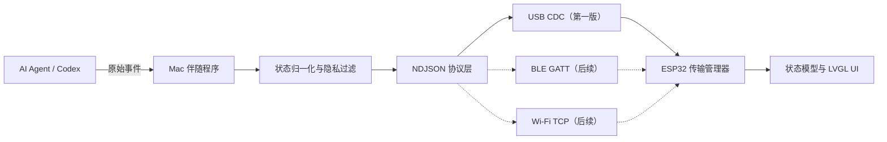
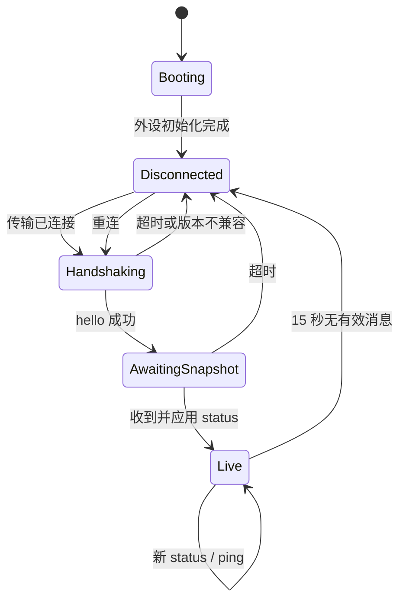

# Saki AI Agent 状态屏产品与通信规格

> 文档版本：0.2.0
> 状态：Release candidate
> 目标硬件：正点原子 ATK-DNESP32S3B3 / ESP32S3 BOX3
> 首版传输：USB CDC ACM 有线虚拟串口
> 首版软件栈：ESP-IDF 5.5.3、FreeRTOS、LVGL 8.4.0

## 1. 产品目标

Saki 是放置在桌面的 AI Agent 状态屏。它通过 Mac 上的伴随程序接收 AI Agent 的工作状态，并在 ESP32S3 BOX3 的 320×240 屏幕上持续显示当前任务、所处阶段、正在进行的动作、耗时和连接状态。

第一版优先保证有线连接稳定、状态可读、断线可感知。后续在不改变状态数据模型和应用层协议的前提下，增加 BLE 和 Wi-Fi 传输，并在有线不可用时自动回退。

### 1.1 核心原则

- 一眼可读：两米内能通过颜色和大字号判断 Agent 是在工作、等待、完成还是出错。
- 安静但有生命感：工作中使用克制的动画，不做持续闪烁或大面积跳变。
- 状态可信：明确区分实时状态、断线后保留的旧状态和协议错误。
- 传输无关：USB、BLE、Wi-Fi 使用同一套消息模型和 JSON 协议。
- 隐私优先：默认不显示完整提示词、隐藏推理、密钥、完整文件路径或终端输出。

## 2. 范围

### 2.1 第一版范围

- 展示一个当前活动任务。
- 展示 Agent 名称、任务标题、主状态、当前动作、进度、耗时和连接方式。
- 支持中文和英文 UTF-8 文本；不支持的字形显示替代符号。
- 通过 ESP32-S3 原生 USB OTG，以 TinyUSB CDC ACM 虚拟串口接收消息。
- Mac 伴随程序负责采集 Agent 事件、归一化状态、发现设备、握手、发送快照和心跳。
- 断线、重连、重复消息、乱序消息和非法消息不能导致设备崩溃或显示错误的新状态。
- 触摸只用于本地查看和唤醒，不向 Agent 发出操作命令。

### 2.2 第一版非目标

- 不显示完整对话、隐藏思维链或连续终端日志。
- 不从设备端启动、暂停、取消或批准 Agent 操作。
- 不同时展示多个任务或完整的多 Agent 拓扑；子 Agent 活动由 Mac 端汇总为当前动作。
- 不在第一版实现 BLE、Wi-Fi、配网、云服务或远程访问。
- 不在设备重启后恢复上一次任务状态；重启后必须等待 Mac 发送新快照。
- 不提供音频、摄像头或 SD 卡功能。

## 3. 系统组成



### 3.1 Mac 伴随程序职责

- 从具体 AI Agent 的事件源读取事件；不同 Agent 通过适配器接入。
- 将原始事件映射为第 6 节定义的统一状态。
- 生成面向用户的简短动作摘要，不传输隐藏推理内容。
- 删除或替换令牌、密码、私密 URL、完整用户目录和其他敏感内容。
- 自动发现 Saki 设备，不永久写死 `/dev/cu.usbmodem*` 端口名。
- 管理握手、完整状态快照、心跳、ACK、超时重发和重连。
- 合并高频事件，避免用无意义的小变化频繁刷新屏幕。

### 3.2 ESP32 固件职责

- 初始化板载 AW9523B、ST7789、CHSC5432 和 LVGL。
- 维护一个权威的当前状态快照。
- 验证协议版本、帧大小、字段类型、状态枚举和消息顺序。
- 只在 LVGL/UI 任务中修改控件；通信回调通过队列提交状态，不能直接操作 LVGL。
- 根据心跳判断连接是否实时，并保留断线前最后状态作为只读旧状态。
- 处理 UTF-8 截断、缺失字形和过长内容，不允许文本破坏布局。

## 4. 展示内容

### 4.1 主屏信息优先级

1. 主状态：Agent 当前处于什么阶段。
2. 任务标题：Agent 正在处理什么任务。
3. 当前动作：Agent 此刻在做什么。
4. 是否需要用户介入。
5. 进度和已用时间。
6. Agent、模型及当前传输方式。

### 4.2 字段定义

| 内容 | 必需 | 展示规则 |
| --- | --- | --- |
| 主状态 | 是 | 大字号、状态色和图标同时表达，不能只依赖颜色 |
| 任务标题 | 活动任务时必需 | 最多两行，超出后省略 |
| 当前动作摘要 | 否 | 最多两行，描述高层动作，如“正在运行测试” |
| 动作类型 | 否 | 显示为小图标或短标签，如编辑、命令、测试、网页 |
| 详细信息 | 否 | 默认不占主屏；等待、失败时优先显示，或在详情视图显示 |
| 进度 | 否 | 支持无进度、未知进度和 0–100% 确定进度 |
| 已用时间 | 否 | 活动状态下递增；终态停止递增 |
| Agent 名称 | 否 | 默认 `Agent`，例如 `Codex` |
| 模型名称 | 否 | 放在页脚，空间不足时优先隐藏 |
| 连接方式 | 是 | `USB`、`BLE`、`Wi-Fi` 或 `离线` |
| 新鲜度 | 是 | 心跳超时后明确标记“连接已断开”，不得继续伪装成实时状态 |

### 4.3 主状态枚举

| 协议值 | 中文文案 | 色彩 | 视觉行为 |
| --- | --- | --- | --- |
| `idle` | 空闲 | 蓝灰 | 静态 |
| `starting` | 正在开始 | 蓝 | 缓慢呼吸 |
| `thinking` | 正在思考 | 紫 | 三点或圆环动画 |
| `working` | 正在工作 | 青蓝 | 缓慢旋转或流动动画 |
| `waiting_user` | 等待你的输入 | 琥珀 | 呼吸提示，突出显示 |
| `waiting_approval` | 等待批准 | 琥珀 | 呼吸提示，突出显示 |
| `completed` | 已完成 | 绿 | 入场动画一次，随后静态 |
| `failed` | 出错了 | 红 | 入场提示一次，随后静态 |
| `cancelled` | 已取消 | 灰 | 静态 |

以下状态由设备根据本地情况生成，不由 Mac 作为任务状态发送：

- `booting`：固件和显示正在初始化。
- `disconnected`：尚未完成握手，或心跳已经超时。
- `protocol_error`：收到不受支持或连续非法的消息。

### 4.4 Agent 事件到状态的推荐映射

| Agent 事件 | 统一状态 |
| --- | --- |
| 用户提交任务，Agent 正在准备 | `starting` |
| 规划、分析、选择下一步 | `thinking` |
| 读取/编辑文件、运行命令、调用工具、浏览网页、执行测试 | `working` |
| Agent 明确要求用户补充信息 | `waiting_user` |
| 等待用户批准命令、权限或外部写操作 | `waiting_approval` |
| 任务正常结束 | `completed` |
| 任务异常结束且无法继续 | `failed` |
| 用户或系统取消任务 | `cancelled` |
| 已连接但没有活动任务 | `idle` |

映射只允许生成高层摘要，例如“正在检查构建结果”。不得把隐藏思维链或未经筛选的内部推理文本写入 `activity.detail`。

## 5. 界面规格

### 5.1 屏幕与视觉基线

- 分辨率：320×240，横屏。
- 默认主题：深色背景，浅色文字，状态色作为强调色。
- 主体字号：状态 24–28 px，任务标题 18–20 px，动作和页脚 14–16 px。
- 四周安全边距：12 px；重要信息不得贴边。
- 动画刷新与消息刷新分离；消息变化不应重建整个 LVGL 页面。
- 不使用持续跑马灯。长文本通过换行、省略和详情视图处理。

### 5.2 主屏布局

```text
┌────────────────────────────────────────┐  y=0
│ Codex                         ● USB    │  顶栏 28 px
├────────────────────────────────────────┤
│  [状态图标]   正在工作          03:42 │  状态区 58 px
│                                        │
│  实现 ESP32 Agent 状态同步             │  标题区，最多 2 行
│                                        │
│  终端  正在编译固件                    │  动作区，最多 2 行
│        idf.py build                     │
│                                        │
│  ████████████░░░░░░░░             62% │  可选进度条
├────────────────────────────────────────┤
│ gpt-5.6                 状态刚刚更新   │  页脚 24 px
└────────────────────────────────────────┘  y=240
```

布局降级顺序：先隐藏模型名称，再隐藏动作类型标签，再缩短详情；主状态和任务标题不能被隐藏。

### 5.3 页面状态

#### 启动页

- 显示 `Saki` 标识和“正在启动”。
- 外设初始化完成后立即进入等待连接页，不强制等待固定时长。
- 若初始化失败，显示失败的外设名称和简短错误码。

#### 等待连接页

- 显示 USB 线缆图标、“等待 Mac 连接”和简短连接提示。
- 不显示上一次运行的任务，避免把旧状态误认为实时状态。

#### 空闲页

- 显示“Agent 空闲”、Agent 名称和当前传输方式。
- 可以降低动画频率和背光，但连接心跳必须继续处理。

#### 活动任务页

- 使用第 5.2 节主屏布局。
- `thinking`、`working` 使用轻量循环动画。
- 收到新的完整状态快照后，只更新发生变化的控件。

#### 等待用户页

- 状态区改为琥珀色，明确区分“等待输入”和“等待批准”。
- `activity.detail` 如果存在，替换普通动作区并最多显示三行。
- 不通过快速闪烁催促用户。

#### 完成、失败和取消页

- 保留任务标题和最终耗时。
- 完成状态使用绿色；失败状态使用红色并优先展示错误摘要。
- 状态保持到 Mac 发送下一条状态或 `clear`，设备不自行将其改为空闲。

#### 断线页

- 保留断线前的最后内容并整体降低亮度。
- 在内容上方显示“连接已断开”和最后更新时间。
- 重连后必须收到新的完整 `status` 快照才能移除断线标记。

### 5.4 触摸行为

- 屏幕变暗时，单击只唤醒背光，不触发其他动作。
- 屏幕已亮时，单击任务/动作区域在摘要视图和详情视图之间切换。
- 详情视图 15 秒无操作后自动返回主屏。
- 第一版不提供取消、批准、重试等会影响 Agent 的触摸按钮。

### 5.5 亮度与空闲策略

- 活动、等待、失败状态：使用正常视觉亮度，默认 80%。
- 空闲超过 5 分钟：降至 35%。
- 断线超过 1 分钟：降至 20%，但保持连接提示可见。
- 收到新状态或发生触摸时恢复正常视觉亮度。
- 具体百分比可编译时配置，后续可通过协议配置。
- 0.2.0 目标板只暴露低有效 LCD 背光使能，未提供可验证的硬件 PWM/电流调光通路；
  因此这些百分比由全屏黑色遮罩实现，是感知亮度而非背光功耗。真正的省电调光不属于
  0.2.0 验收范围。

### 5.6 字体与文本限制

- 协议文本统一为 UTF-8。
- 固件至少包含 ASCII、数字、固定中文界面文案以及常用中英文字形。
- 不支持的字符显示 `□`，不能导致解析或绘制失败。
- 截断必须发生在 UTF-8 字符边界，不能产生非法字节序列。
- 第一版不支持 Emoji 彩色字体；Emoji 可替换为普通图标或 `□`。

## 6. 状态数据模型

设备只维护一个状态快照。`status` 消息始终表示完整快照，不使用隐式字段合并：缺失的可选字段会清除旧值。这一规则可以保证重连和传输切换后不会残留旧字段。

### 6.1 状态对象

| 字段 | 类型 | 必需 | 限制与语义 |
| --- | --- | --- | --- |
| `state` | string | 是 | 第 4.3 节中的协议状态 |
| `task.id` | string | 活动任务时是 | 最多 64 字节；在一次任务生命周期内稳定 |
| `task.title` | string | 活动任务时是 | UTF-8，最多 160 字节 |
| `activity.kind` | string | 否 | `plan`、`read`、`edit`、`shell`、`web`、`test`、`message`、`other` |
| `activity.summary` | string | 否 | UTF-8，最多 240 字节 |
| `activity.detail` | string | 否 | UTF-8，最多 512 字节；必须经过隐私过滤 |
| `progress.mode` | string | 否 | `none`、`indeterminate` 或 `determinate` |
| `progress.percent` | integer | 条件必需 | `determinate` 时为 0–100 |
| `progress.label` | string | 否 | UTF-8，最多 64 字节 |
| `elapsed_ms` | integer | 否 | 非负；活动状态下设备从该基准继续递增 |
| `agent.name` | string | 否 | 最多 32 字节，默认 `Agent` |
| `agent.model` | string | 否 | 最多 64 字节 |

`idle` 状态允许省略 `task`、`activity`、`progress` 和 `elapsed_ms`。设备收到活动状态后，以 `elapsed_ms` 和本地单调时钟为基准每秒刷新显示；下一条 `status` 完整替换该基准，从而修正设备计时误差。`starting`、`thinking`、`working`、`waiting_user` 和 `waiting_approval` 持续计时；终态和 `idle` 停止递增，连接中断时冻结在断线瞬间。

`progress.mode=indeterminate` 不表示任何隐含百分比。设备显示一个固定宽度的短条，在进度槽内使用 ease-in-out 曲线平滑往返；不得在边界瞬间跳回，也不得因新状态事件重启动画。`determinate` 才按 `progress.percent` 显示静态 0–100%，`none` 或断线时停止并隐藏进度动画。

### 6.2 动作类型显示

未知的 `activity.kind` 不构成协议错误，设备必须按 `other` 处理。这允许未来增加新的动作类型而不要求同步升级固件。

## 7. 通信方式

### 7.1 第一版：USB CDC ACM

- 使用 ESP32-S3 原生 USB OTG 和 TinyUSB CDC ACM，从 Mac 看起来是虚拟串口。
- Mac 端串口库使用 115200、8N1、无硬件流控；USB CDC 实际传输速率不由该逻辑波特率限制。
- 设备 USB Product String 设为 `Saki Agent Display`。
- USB Serial String 使用芯片唯一标识生成，不能把 `/dev/cu.usbmodem*` 端口名当作设备身份。
- Mac 端先按 VID/PID 和 Product String 筛选，再通过协议握手最终确认设备。
- CDC DTR 有效且握手成功后才视为已连接。
- 调试日志不能混入应用 CDC 的 NDJSON 数据流；日志使用独立控制台或在发布构建中降低等级。

### 7.2 后续：BLE GATT

- ESP32 作为 BLE Peripheral，Mac 作为 Central。
- 提供一个自定义 Saki Service、一个 Host→Device Write Characteristic 和一个 Device→Host Notify Characteristic。
- Mac 写入使用 Write With Response；设备回复和异步事件使用 Notify。
- NDJSON 字节流按协商后的 ATT MTU 分片，接收端持续拼接直到 `\n` 后再解析。
- 必须支持 LE Secure Connections 配对；已绑定设备可自动重连。
- BLE 层不得重新定义状态字段或消息类型。

建议预留 UUID：

| 用途 | UUID |
| --- | --- |
| Saki Service | `9f6d0100-7c7a-4c3b-9d9a-73616b690001` |
| Host→Device RX | `9f6d0101-7c7a-4c3b-9d9a-73616b690001` |
| Device→Host TX | `9f6d0102-7c7a-4c3b-9d9a-73616b690001` |

### 7.3 后续：Wi-Fi TCP

- ESP32 以 Wi-Fi STA 接入与 Mac 相同的局域网，并作为 TCP Server。
- 默认端口：`8765`。
- 使用 mDNS 服务 `_saki-agent._tcp.local` 发现设备。
- 建立 TCP 连接后使用完全相同的握手、NDJSON 帧和心跳。
- Wi-Fi 凭据通过 USB 或 BLE 配置，不能硬编码在固件或仓库中。
- 正式启用 Wi-Fi 前必须加入配对令牌；涉及非可信网络时应使用 TLS。

### 7.4 传输优先级与切换

后续同时启用多种传输时，默认优先级为：

```text
USB CDC > BLE GATT > Wi-Fi TCP
```

- 任一时刻只有一个活动传输可以提交状态。
- 候选传输必须完成握手并收到一条完整 `status` 快照，才能接管 UI。
- USB 断开后保留 2 秒重连宽限期，再选择可用的下一优先级传输。
- 更高优先级传输恢复时，先完成握手和快照同步，再原子切换，避免界面短暂变空。
- 同一个 Mac 在不同传输间切换时应继续使用相同 `session`，以便设备识别同一逻辑会话。

## 8. 应用层协议

### 8.1 编码与分帧

- 编码：UTF-8 JSON。
- 分帧：每个 JSON 对象占一行，以单个 `\n` 结束，即 NDJSON。
- 接收端兼容 `\r\n`，解析前移除末尾 `\r`。
- JSON 字符串中的换行必须按 JSON 规则转义，不能出现原始换行字节。
- 单帧最大 2048 字节，包含 JSON 内容但不包含末尾换行。
- 超长帧必须丢弃到下一个换行符，并返回 `frame_too_large`，不能截断后尝试解析。
- 第一版不使用二进制帧、压缩或额外 CRC；USB、BLE、TCP 的链路校验与应用 ACK 足以发现传输问题。

### 8.2 公共信封字段

| 字段 | 类型 | 必需 | 说明 |
| --- | --- | --- | --- |
| `v` | integer | 是 | 协议主版本；本文件定义为 `1` |
| `type` | string | 是 | 消息类型 |
| `id` | integer | 发起消息时是 | 发送方单调递增的 uint32 消息编号，允许回绕 |
| `session` | string | Host 消息时是 | 当前 Mac 会话 UUID；一次伴随程序运行期间稳定 |
| `seq` | integer | 状态类消息时是 | 当前会话中的单调递增状态序号 |
| `reply_to` | integer | 回复消息时是 | 被回复消息的 `id` |

未知的额外字段必须被忽略，以保证协议的向前兼容性。字段类型错误、缺少必需字段或不支持的主版本必须返回 `error`。

### 8.3 握手

Mac 打开串口后发送：

```json
{"v":1,"type":"hello","id":1,"session":"90d8836d-0cf1-4fc6-bffe-4b8230faaf17","role":"host","client":{"name":"saki-mac","version":"0.1.0"}}
```

设备确认身份和能力：

```json
{"v":1,"type":"hello","id":1,"reply_to":1,"role":"device","device":{"name":"saki-box3","fw":"0.1.0","id":"0123456789ab"},"screen":{"width":320,"height":240},"capabilities":["status","progress","utf8","touch-detail"]}
```

握手规则：

1. 双方仅在 `v=1` 时继续。
2. 设备回复 `hello` 后进入“已连接、等待快照”状态。
3. Mac 必须立即发送完整 `status`；在此之前设备不得移除断线标记。
4. 3 秒内未完成握手则关闭连接并重试。

### 8.4 状态快照

工作中的完整状态示例：

```json
{"v":1,"type":"status","id":42,"session":"90d8836d-0cf1-4fc6-bffe-4b8230faaf17","seq":18,"state":"working","task":{"id":"task-20260902-001","title":"实现 ESP32 Agent 状态同步"},"activity":{"kind":"shell","summary":"正在编译固件","detail":"idf.py build"},"progress":{"mode":"determinate","percent":62,"label":"Build"},"elapsed_ms":222000,"agent":{"name":"Codex","model":"gpt-5.6"}}
```

等待批准示例：

```json
{"v":1,"type":"status","id":43,"session":"90d8836d-0cf1-4fc6-bffe-4b8230faaf17","seq":19,"state":"waiting_approval","task":{"id":"task-20260902-001","title":"实现 ESP32 Agent 状态同步"},"activity":{"kind":"shell","summary":"需要批准安装构建工具","detail":"允许安装 Ninja 后才能继续编译"},"progress":{"mode":"indeterminate"},"elapsed_ms":238000,"agent":{"name":"Codex","model":"gpt-5.6"}}
```

空闲示例：

```json
{"v":1,"type":"status","id":44,"session":"90d8836d-0cf1-4fc6-bffe-4b8230faaf17","seq":20,"state":"idle","agent":{"name":"Codex","model":"gpt-5.6"}}
```

处理规则：

- `status` 是完整替换，不是 patch。
- 同一 `session` 中，`seq` 小于或等于最后已应用值的消息不得覆盖界面。
- 新 `session` 完成握手后重置 `seq` 基准。
- 设备完成语义校验并将快照放入 UI 队列后才返回成功 ACK。
- Mac 端只在语义状态变化时发送；连续文本变化最多合并为每秒 4 次更新。

### 8.5 ACK

成功应用状态：

```json
{"v":1,"type":"ack","id":7,"reply_to":42,"ok":true,"applied":true,"last_seq":18}
```

收到重复或旧快照：

```json
{"v":1,"type":"ack","id":8,"reply_to":42,"ok":true,"applied":false,"last_seq":18}
```

- `status`、`clear` 和未来的配置消息需要 ACK。
- Mac 等待 ACK 的默认超时为 1 秒，最多重发 2 次；重发必须保留原 `id` 和 `seq`。
- 连续 3 次无 ACK 时判定连接异常并重新握手。

### 8.6 心跳

Mac 每 5 秒发送一次：

```json
{"v":1,"type":"ping","id":45,"session":"90d8836d-0cf1-4fc6-bffe-4b8230faaf17","sent_at":1788336000000}
```

设备回复：

```json
{"v":1,"type":"pong","id":9,"reply_to":45,"uptime_ms":384210,"last_seq":20,"diagnostics":{"valid_frames":42,"invalid_frames":1,"oversized_frames":0,"old_sequences":2,"ui_queue_overwrites":3,"tx_drops":0,"heartbeat_timeouts":0},"runtime":{"heap_free_bytes":8000000,"heap_min_bytes":7900000,"internal_free_bytes":180000,"internal_min_bytes":160000,"app_stack_min_bytes":1400,"ui_stack_min_bytes":3200,"usb_stack_min_bytes":2800}}
```

- 任意一条通过验证的 Host 消息都会刷新最后活动时间。
- 15 秒未收到有效 Host 消息，设备进入 `disconnected`。
- 恢复字节流后必须重新握手并发送完整快照，不能仅靠迟到的 `ping` 恢复实时标记。
- 固件 `0.1.2` 起，`pong.diagnostics` 提供本次启动以来的饱和诊断计数；旧固件可以省略该对象，Host 必须保持兼容。
- 固件 `0.2.0-dev` 起可选返回 `pong.runtime`。heap 字段分别表示当前/历史最低的全部 8-bit heap 与内部 8-bit heap；stack 字段表示 app 初始化任务、UI 任务和 USB 任务的历史最低剩余栈，单位均为 bytes。
- Host `doctor` 对旧固件缺失 `runtime` 只发出兼容性警告；对于支持该对象的新固件，内部 heap 历史最低值小于 32 KiB，或任一 Saki 任务 stack watermark 小于 1 KiB，视为不健康。

### 8.7 清空状态

```json
{"v":1,"type":"clear","id":46,"session":"90d8836d-0cf1-4fc6-bffe-4b8230faaf17","seq":21}
```

`clear` 清除任务内容并进入空闲页。它与发送 `state=idle` 的区别是明确要求移除所有上次任务字段。设备成功清空后回复 ACK。

### 8.8 错误消息

```json
{"v":1,"type":"error","id":10,"reply_to":43,"code":"invalid_state","message":"unsupported state value"}
```

第一版错误码：

| 错误码 | 含义 |
| --- | --- |
| `invalid_json` | JSON 无法解析，或整帧不是合法 UTF-8 |
| `frame_too_large` | 帧超过 2048 字节 |
| `unsupported_version` | 不支持的协议主版本 |
| `missing_field` | 缺少必需字段 |
| `invalid_field` | 字段类型或取值非法 |
| `invalid_state` | 未知主状态 |
| `not_handshaken` | 握手前发送了不允许的业务消息 |
| `busy` | UI 队列暂时无法接收新快照 |
| `internal_error` | 设备内部错误 |

`error.message` 只用于诊断，不应包含设备内存内容或敏感数据。单个非法帧不能断开连接；连续 5 个非法帧后设备可以重新进入等待握手状态。

### 8.9 状态机



## 9. 隐私与安全

- Mac 端不得传输隐藏思维链，只发送适合展示的高层状态摘要。
- 默认移除 API Key、访问令牌、密码、Cookie、授权头和包含凭据的 URL。
- 用户主目录应缩写为 `~`；详情中默认只保留文件名或项目内相对路径。
- 第一版 USB 连接以物理访问为信任边界，不提供应用层加密。
- BLE 必须配对和绑定；Wi-Fi 必须使用配对令牌，跨非可信网络时使用 TLS。
- 设备发送的诊断错误不得回显收到的完整敏感消息。
- 固件日志默认不打印完整 `status` JSON；调试模式也必须支持关闭内容日志。

## 10. 性能与资源约束

- 有线状态端到端显示延迟目标：语义事件产生后小于 250 ms，不包含 Agent 事件源本身的延迟。
- 冷启动到等待连接页目标：小于 2 秒。
- USB 枚举完成后，Mac 发现和握手目标：小于 3 秒。
- 协议接收缓冲区必须有固定上限；不得按对端声明长度进行无限制分配。
- 通信更新推荐上限：每秒 4 条 `status`，短时突发最多每秒 10 帧。
- LVGL 动画目标 20–30 FPS；通信解析不得阻塞 UI 任务。
- 状态对象在成功解析后通过双缓冲或不可变快照原子替换，避免 UI 读到部分更新。
- 频繁状态更新不写 NVS，避免 Flash 磨损。

## 11. 异常与恢复行为

| 场景 | 预期行为 |
| --- | --- |
| Mac 未运行 | 显示等待连接页 |
| USB 被拔出 | 15 秒内进入断线状态，保留并淡化最后快照 |
| USB 快速重插 | 重新发现、握手并发送完整快照 |
| Mac 伴随程序重启 | 使用新 `session`，设备重置序号基准 |
| 收到重复状态 | ACK，但 `applied=false`，界面不回退 |
| 收到半帧后断线 | 丢弃未完成帧；重连后从空缓冲开始 |
| 单个非法 JSON | 返回错误并继续读取下一帧 |
| 连续非法 JSON | 5 次后放弃当前会话并要求重新握手 |
| UI 队列已满 | 返回 `busy`；Mac 合并最新状态后重试 |
| Agent 活跃状态超过 120 秒无源事件 | Host 降级为 `waiting_user` 并提示检查 Mac；不得猜测具体错误原因 |
| 不支持的中文字符 | 使用替代字形，其他文本继续显示 |
| LCD/触摸初始化失败 | 显示可用的错误信息并保留串口诊断；不能无限重启 |

## 12. 第一版验收标准

下列功能项和基础稳定性/性能项构成 `0.2.0` 发布门槛；24 小时/
10,000 次 soak、Mac 睡眠/唤醒矩阵和 LCD 最后像素的光学延迟属于可选扩展验证，不阻止
本版本发布。

### 12.1 功能

- Mac 能自动发现设备并完成协议握手，不依赖固定串口路径。
- 九种协议主状态都能显示正确的文案、颜色和图标。
- 中英文任务标题和动作摘要不会越界或破坏布局。
- 确定进度、未知进度和无进度三种模式显示正确。
- 活动耗时持续递增，完成/失败/取消后停止。
- 等待输入和等待批准在两米距离下能够明显区别于普通工作状态。
- 单击可在摘要和详情之间切换，暗屏时首次单击只唤醒。
- `clear` 能清除所有上次任务字段并进入空闲页。

### 12.2 稳定性

- release 固件完成至少 100 次连续状态更新 smoke，无协议异常、明显内存下降或 UI 卡死。
- 拔插 USB 3 次均能自动恢复，不要求设备重启。
- 随机非法帧、超长帧、重复帧和乱序帧不会覆盖为错误状态或导致崩溃。
- 心跳中断后 15 秒内显示断线；恢复后必须用完整快照恢复。
- USB 业务数据流中不存在 ESP-IDF 日志污染。
- 可选扩展验证：连续运行 24 小时且接收至少 10,000 次状态更新；Mac 睡眠/唤醒后自动
  恢复。未执行这两项不阻止当前版本发布。

### 12.3 性能

- Agent hook 源时间戳到设备确认状态入队的延迟小于 250 ms。
- 工作动画运行时仍能及时处理串口数据。
- 全屏更新和长文本更新不产生明显撕裂或超过 500 ms 的冻结。
- LCD 最后像素的高速摄影或光学探头测量为可选扩展验证，不属于当前版本发布门槛。

## 13. 实施阶段

工程结构、Mac/固件边界、构建烧录和调试方式见 [IMPLEMENTATION.md](./IMPLEMENTATION.md)，可执行任务和完成条件见 [TASKS.md](./TASKS.md)。

### Phase 1：有线第一版

1. Stage 0：验证 Ninja、ESP-IDF 5.5.3、厂家 LCD/触摸/LVGL 和 USB CDC 基线。
2. Stage 1：建立 `firmware/`、`host/`、`protocol/` 和测试 fixture 结构。
3. Stage 2：实现设备状态模型、全部静态 UI、触摸详情和背光策略。
4. Stage 3：实现传输抽象、TinyUSB CDC、NDJSON 协议和固件测试。
5. Stage 4：实现 Python Mac Host、串口发现、握手、ACK、心跳、重连和 mock adapter。
6. Stage 5：接入第一个真实 Agent adapter，并完成隐私过滤和状态映射。
7. Stage 6：完成 `0.2.0` 稳定性、USB 拔插、非法帧和性能基线，生成第一版产物；长期 soak
   和光学测量按需补充。

无线回退与增强功能不属于本版本，实施顺序和候选版本见
[项目路线图](../../ROADMAP.md)。

## 14. 版本兼容规则

- `v` 是协议主版本。主版本不一致时拒绝业务消息并返回 `unsupported_version`。
- 新增可选字段不增加主版本，旧端必须忽略未知字段。
- 删除字段、改变字段含义或改变分帧方式必须增加主版本。
- 新增 `activity.kind` 可以不增加主版本，未知值按 `other` 处理。
- 固件和 Mac 伴随程序各自使用语义化版本；握手中报告版本，但不以版本字符串代替能力协商。
- `0.1.x` 只作为开发期真机验证编号，不作为公开首版；第一个正式 release 为 `0.2.0`。
- `dev` profile 报告固件版本 `0.2.0-dev`，Mac 可安装版本使用 PEP 440 等价值 `0.2.0.dev0`；只有通过发布检查的 release profile 才报告 `0.2.0`。
