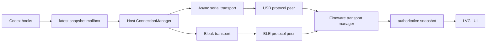
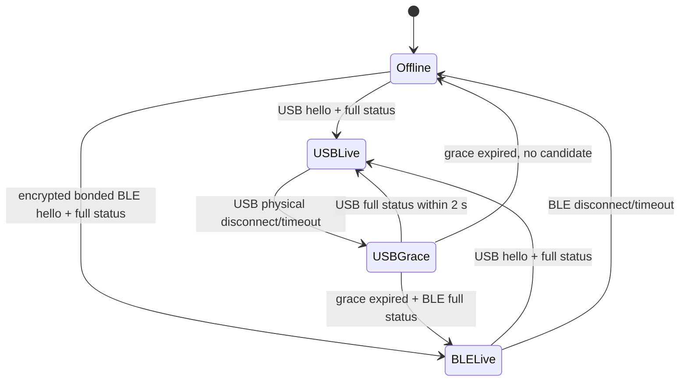

# Saki 0.3.0 工程实施设计

> 文档版本：0.3.0 历史开发设计
> 状态：已归档；能力已并入 0.4.5，本文件不再作为在制计划
> 产品规格：[SPEC.md](./SPEC.md)
> 执行清单：[TASKS.md](./TASKS.md)

## 1. 设计目的

本文把 0.3.0 的安全 BLE fallback 规格拆成可落地的代码边界、并发模型、实施顺序和验证
方法。协议字段、安全行为和验收目标以 [SPEC.md](./SPEC.md) 为准。

0.3.0 不是在现有 USB worker 旁简单增加一个 GATT callback。当前实现中协议 engine 绑定
单一 TX callback、状态解析直接写死 `USB`，Host service 也直接依赖 `SerialSession`。
因此第一步必须先做可回归的传输无关重构，再接入 NimBLE 和 Bleak。

共享协议继续限制 `elapsed_ms` 为 `0..9007199254740991`，即 JSON 安全整数范围；Schema、
Python Host 和基于 cJSON double 的固件解析器使用同一上限，避免跨端精度分歧。

## 2. 技术选择

| 层面 | 0.3.0 选择 | 说明 |
| --- | --- | --- |
| 固件 BLE Host | ESP-NimBLE | 只需要 BLE，内存占用低于同时支持 Classic 的 Bluedroid |
| 固件角色 | Peripheral + GATT Server | 与 0.2.0 预留设计一致 |
| Mac BLE | Bleak/CoreBluetooth | Python asyncio API，可作为可选依赖接入现有 Host |
| GATT 数据路径 | RX Write With Response、TX Notify | 保持请求方向有 ATT 确认，应用层仍使用 ACK |
| 安全 | LESC Just Works + encrypted bond | 无固定 PIN；以 K2 限时窗口作为本地授权边界 |
| 本地控制 | 单个 K2 按键 | 短按暂停/重连，2 秒配对，5 秒清全部 bond |
| bond 数量 | 1 | 对齐单 Mac、单活动任务的产品范围 |
| 应用协议 | v1 UTF-8 NDJSON | 不增加 BLE 专属帧或字段 |
| transport 仲裁 | 固件强制、Host 配合 | 防止并发链路竞争；固定 `USB > BLE` |
| Host session | 进程级共享 | 跨 transport 保持同一 session，id/seq 全局递增 |

实现依据以仓库固定的 ESP-IDF 5.5.3 源码和示例为准。ESP-NimBLE 的 GATT、安全、NVS
store 和 GAP 回调优先参考本机同版本 `examples/bluetooth/nimble/bleprph`，不从其他 IDF
版本复制 API。

## 3. 目标架构



关键边界：

- transport 只搬运有序字节并报告链路事件；不理解 JSON 或状态语义。
- protocol peer 拥有独立 framer、握手、回复路由和 heartbeat；不直接修改 UI。
- firmware transport manager 统一决定 session/seq、优先级和状态提交。
- Host `ConnectionManager` 拥有 transport 选择与切换；hook collector 不等待扫描或配对。
- UI 只读取权威快照和本地配对事件，不感知 GATT 或 Bleak。

## 4. 固件重构

### 4.1 组件目录

```text
firmware/components/
├── saki_transport/
│   ├── include/saki_transport.h
│   └── saki_transport.c
├── saki_usb/
├── saki_ble/
├── saki_buttons/
├── saki_protocol/
├── saki_model/
├── saki_ui_policy/
└── saki_ui/
```

`saki_transport` 是仲裁器，不承载具体 USB/BLE 驱动。`saki_usb` 和 `saki_ble` 分别拥有
自己的任务、RX buffer 与 TX queue。

### 4.2 链路与协议 peer

传输标识使用枚举而不是字符串比较：

```c
typedef enum {
    SAKI_TRANSPORT_NONE = 0,
    SAKI_TRANSPORT_BLE = 1,
    SAKI_TRANSPORT_USB = 2,
} saki_transport_id_t;
```

枚举值同时表达优先级，但业务逻辑通过命名函数比较，避免以后加入 Wi-Fi 时散落数值判断。

每个 transport 创建一个 `saki_protocol_peer_t`，至少包含：

- 独立 `saki_ndjson_framer_t`；
- `connected`、`encrypted`、`bonded`、`handshaken` 和 TX-ready 标志；
- 当前 hello session 和 heartbeat deadline；
- transport id/name；
- 指向该 transport TX queue 的 callback/context；
- peer 级非法帧计数和 last request metadata。

当前 `saki_protocol_engine_t` 的解析和编码逻辑继续复用，但需要拆开三类状态：

1. peer 状态：分帧、握手、活动时间和回复通道；
2. 全局状态：活动 session、最后 seq 和权威 transport；
3. 设备级诊断：UI overwrite、总非法输入、切换与资源指标。

### 4.3 状态候选接口

`status` 解析成功后不直接调用 UI callback，而是向仲裁器提交不可变候选：

```c
typedef struct {
    saki_transport_id_t transport;
    const char *session;
    uint32_t seq;
    saki_state_snapshot_t snapshot;
} saki_transport_candidate_t;

typedef enum {
    SAKI_CANDIDATE_APPLIED,
    SAKI_CANDIDATE_STALE,
    SAKI_CANDIDATE_BUSY,
} saki_candidate_result_t;
```

映射规则：

- `APPLIED`：状态进入 UI queue，protocol 返回 `ack applied=true`；
- `STALE`：同 session 的重复/旧 seq，返回 `ack applied=false`；
- `BUSY`：低优先级或 USB 宽限期内的状态，返回现有 `busy` error。

只有 `APPLIED` 才更新全局 session/seq、last live snapshot 和 transport label。`clear` 走同一
候选路径，不能保留 USB 硬编码。

### 4.4 仲裁状态机



- USB 连接本身不清除 BLE 状态；只有 USB 完整快照成功提交才完成抢占。
- BLE 连接本身也不改变 UI；未握手或没有完整快照的候选不算可用。
- 宽限期由 transport manager 的单调时钟驱动，不在 USB callback 内阻塞。
- active peer 的物理断线、协议 heartbeat timeout 和安全状态丢失统一转换为 link-down 事件。
- 切换只发布一个完整快照，UI 根据“状态是否变化”决定动画，不因 transport 变化重播终态动画。

### 4.5 USB 适配

`saki_usb` 保持 TinyUSB、DTR、4096 B StreamBuffer 和独立 TX queue，但改为：

- 把 RX 字节交给 USB peer，而不是全局唯一 engine；
- 连接事件交给 transport manager；
- transmit callback 只属于 USB peer；
- `poll` 只推进 USB peer heartbeat 和 transport manager deadline；
- stack/runtime 指标继续保留；
- 重构前后所有现有 Unity、doctor、cycle、fuzz 和 soak 行为一致。

USB 回归必须在引入 NimBLE 之前完成，便于把架构回归与无线问题分开定位。

## 5. 固件 BLE 组件

### 5.1 初始化顺序

计划顺序：

1. 初始化 NVS 和现有 BSP/LVGL；
2. 初始化 model、UI、transport manager 和 USB peer；
3. 初始化 NimBLE controller/host；
4. 注册 GAP/GATT 服务与安全 callback；
5. 初始化 NimBLE bond store；
6. 启动 NimBLE host task 和 BLE worker；
7. 根据 bond 状态启动不可连接或 allow-list 广播。

NimBLE 初始化失败不应导致 USB 失效。UI 和 `doctor` 报告 BLE unavailable，USB 继续工作。

### 5.2 GATT 服务

GATT table 静态注册：

- Service UUID：`9f6d0100-7c7a-4c3b-9d9a-73616b690001`；
- RX：`BLE_GATT_CHR_F_WRITE` 加加密写权限；
- TX：`BLE_GATT_CHR_F_NOTIFY` 加加密通知/订阅权限；
- 不启用 Write Without Response、Read、Indicate 或 dynamic service。

GATT access callback 只做：

- 检查 conn handle、加密/bond 状态和 RX characteristic；
- 计算 mbuf 总长度并检查有界容量；
- 按顺序复制到 BLE RX StreamBuffer；
- 在 buffer 无空间时返回适当 ATT error 并增加计数。

callback 不解析 JSON、不调用 LVGL、不等待队列空间。

### 5.3 RX/TX worker

初始资源建议，最终以 Stage 0 profiling 调整：

| 资源 | 初始值 | 说明 |
| --- | ---: | --- |
| BLE RX StreamBuffer | 4096 B | 与 USB 相同，可容纳最大帧和突发 |
| BLE TX message queue | 8 × 1024 B | 容纳扩展后的 pong/诊断回复，不按 MTU 动态分配 |
| BLE worker stack | 10 KiB | 包含分片调度，真机水位后再缩减 |
| NimBLE connections | 1 | 产品范围限制 |
| Preferred ATT MTU | 256 | 仍支持协商为 23 |

2026-09-07 目标 macOS/CoreBluetooth 与 dev 固件实测协商 ATT MTU 为 256，Host 的
Write With Response payload 为 253 B；保守 20 B 路径继续由 fake backend 测试覆盖。
2026-09-14 使用允许的顶层扩展字段把合法 status payload 填充到严格 2,048 B，真机跨 9 个
Write With Response 分片完成，设备 `applied=true`，ACK 为 538.7 ms；全已知字段的 1,441 B
status payload ACK 为 356.3 ms。Host 与固件的断线清半帧行为均有离线回归测试。
同一 Mac 随后完成 3 次 Bluetooth off/on：关闭态错误稳定归类为 powered off，重新开启后
原 bond 均恢复，BLE 握手 min/mean/P95/max 为 6,566.8/6,850.1/7,345.9/7,345.9 ms。

BLE worker 串行执行：

- 从 RX StreamBuffer 取字节并喂给 BLE protocol peer；
- 把 protocol 回复按当前 `mtu - 3` 拆成 Notify；
- 处理 Notify congestion/completion，上一片完成或可继续排队后才发送下一片；
- 推进 peer heartbeat、配对窗口和 K2 手动暂停状态；
- 断线时清空 RX 半帧、TX queue 和订阅状态。

完整设备回复受 1024 B TX 上限约束；如果未来回复超过该上限，应先调整共享协议设计，
不能在 BLE 组件中私自截断。

### 5.4 广播与隐私

- Advertising data 放 flags 和完整 Saki Service UUID；Local Name 可放 scan response。
- 不广播 `device.id`、bond 数量或配对状态。
- 无 bond、非配对窗口：不可连接广播。
- 配对窗口：可连接、允许一个 Central；窗口结束立即停止未授权连接能力。
- 有 bond：启用地址解析和 allow list，仅对已绑定 identity 接受连接。
- 清除最后 bond 后启用 NimBLE identity reset 选项，避免长期固定 IRK 带来的跟踪风险。

### 5.5 安全配置

build defaults 和运行时 `ble_hs_cfg` 同时审查：

- NimBLE Peripheral/GATT Server only；关闭未使用 Central/GATT Client 角色；
- Security Manager、LE encryption、SC、NVS persist 开启，安全等级为 level 2；运行时
  `sm_sc_only=0`，因为 NimBLE 的该模式会强制 level 4/MITM，与 NoIO Just Works 冲突；
- Legacy pairing、SC debug keys 关闭；
- `sm_bonding=1`、`sm_mitm=0`、`sm_sc=1`；
- IO capability 为 NoInputNoOutput；双方分发加密与 identity key；
- 最大 connection/bond 为 1，并在运行时再次拒绝额外 peer。

`BLE_GAP_EVENT_REPEAT_PAIRING` 不采用 ESP-IDF 示例中“删除旧 bond 后重试”的便利策略；Saki
应返回拒绝，直到用户长按 K2 5 秒明确清除绑定。

### 5.6 K2 输入与 BLE 控制

K1 保持未分配，0.3.0 只使用 K2。K2 接在 AW9523B `P0_1`，按下为高电平；当前厂家
`aw9523b_key_scan()` 适合简单点击但会多次执行 I²C 读取，不能直接承担长按状态机。

新增 `saki_buttons` 薄层：

- 每 20–50 ms 一次性读取 AW9523B P0 输入，避免同一轮重复 I²C transaction；
- 对 K2 做稳定电平消抖，并用单调毫秒记录按下时长；
- 在 UI/input task 中轮询或通过有界事件队列串行访问共享 I²C；
- 首版不启用 AW9523B GPIO interrupt，避免在未核对 GPIO42 与触摸接线前引入冲突；
- 只发布 `SHORT_RELEASE`、`PAIR_RELEASE`、`CLEAR_THRESHOLD` 三种确定事件。

单键判定规则：

- 小于 2 秒松开：短按；若 BLE 已连接则断开并设置 runtime-only `manual_paused`，若未连接且
  有 bond 则清除暂停并启动/刷新 allow-list 广播；无 bond 时只显示长按提示。
- 达到 2 秒：只显示“松开配对/继续按住清除”的进度，不立刻开放配对。
- 2 秒及以上、5 秒以内松开：打开 120 秒配对窗口。
- 达到 5 秒：只产生一次清除全部 bond 事件，不再产生配对事件；动作不需要二次确认。
- K2 动作会唤醒屏幕并显示反馈，但不改变 Agent 快照。
- `manual_paused` 不写 NVS；设备重启恢复已绑定 BLE 的正常自动重连。

NimBLE GAP/worker 向长度有界的 UI queue 发布：

- pairing window opened/expired；
- pairing succeeded/failed；
- bond present/cleared；
- BLE connected/encrypted/disconnected；
- manual paused/reconnect requested。

K2 event 通过 control queue 交给 BLE worker，由 worker 统一执行 advertising、disconnect 和
bond store 操作；按键/UI task 不直接调用 NimBLE。

### 5.7 NVS 与清除绑定

- 使用 ESP-NimBLE store API 保存 bond，不自行序列化密钥。
- 清除操作只调用 NimBLE bond/store API，并重建 allow/resolving list。
- 不调用 `nvs_flash_erase()`，不改分区表，不触碰其他 namespace。
- 清除后断开现有 BLE peer、清空协议半帧和 session，再回到不可连接广播。
- 配对成功/清除绑定都不把原始密钥写入日志。

## 6. Host 重构

### 6.1 计划目录

```text
host/src/saki_host/
├── connection.py
├── protocol.py
├── service.py
└── transports/
    ├── base.py
    ├── serial.py
    └── ble.py
```

### 6.2 异步传输接口

Bleak 原生 asyncio，而现有 `SerialSession` 是同步 request/response。0.3.0 将协议会话提升为
共享异步层，避免复制 ACK、framer 和超时逻辑：

```python
class AsyncByteTransport(Protocol):
    kind: TransportKind
    identity_hint: str

    async def connect(self) -> None: ...
    async def read(self, max_bytes: int) -> bytes: ...
    async def write(self, data: bytes) -> None: ...
    async def close(self) -> None: ...
```

`ProtocolSession` 统一负责：

- 编解码与有界 receive buffer；
- 单 writer 和 request id→Future 匹配；
- hello、status、clear、ping；
- transport-aware timeout 和原 id/seq 重发；
- unsolicited/迟到回复丢弃和断线取消。

Serial adapter 内部继续用 `asyncio.to_thread()` 承载 pyserial 阻塞调用。CLI 改用同一异步
session，不能保留一套只供 CLI 的协议实现。

### 6.3 Bleak transport

`transports/ble.py` 的 import 必须延迟到 BLE 实际启用时，以便没有安装 extra 的 USB 用户
正常启动。

连接流程：

1. 按 Service UUID 扫描，优先尝试缓存 CoreBluetooth UUID；
2. 创建 `BleakClient` 并限制服务发现到 Saki Service；
3. 验证 RX/TX UUID 和属性；
4. `start_notify(TX)`，借由加密特征在 K2 窗口内触发 macOS 自动配对；
5. 等待连接完成、通知订阅、加密和 bond 建立；
6. 创建通用 `ProtocolSession`，发送 hello 并校验 capability/device id；
7. 发送最新完整状态。

Bleak 在 macOS 没有显式 pair/unpair API，因此 `ble pair` 命令实质上是“在设备配对窗口内
连接并访问受保护特征”。不得把 `BleakClient.pair()` 当成可移植前提。

### 6.4 BLE 字节流

- `write()` 按当前连接的 `mtu_size - 3` 切块，并对每块调用
  `write_gatt_char(..., response=True)`。
- 如果 backend 无法提供可信 MTU，则使用保守 20 B payload；不得猜测更大的值。
- Notify callback 把 bytes 复制到有界 `asyncio.Queue`；queue 满视为连接失败并重连，不能
  静默丢字节后继续解析。
- reader 把通知片段顺序合并，由共享 NDJSON framer 按 LF 产出回复。
- 单个连接只允许一个写协程；协议帧不能交错。
- disconnect callback 只发事件并解除 pending Future，不执行重连或打印正文。

### 6.5 Host 逻辑 session

`SakiHostService` 启动时创建一个 `ProtocolCodec`/logical session，由所有 transport
连接共享。ConnectionManager 切换链路时：

- 不重新生成 session UUID；
- 不重置 message id 或 seq；
- 对最新 mailbox 状态生成新的完整 status 和 seq；
- 等候候选链路 ACK 后才发布“切换成功”并关闭旧链路；
- 失败时保留旧链路和旧权威状态，只重试候选。

Host 进程重启仍按既有规则生成新 session。

### 6.6 自动选择

`ConnectionManager` 的 `auto` 模式策略：

1. 启动时先做快速 USB 枚举；找到设备则使用 USB。
2. 没有 USB 时，在已安装 Bleak 且有缓存设备的情况下扫描 BLE。
3. USB 活动时不维持 BLE 业务会话；USB 消失后等待设备同样的 2 秒 grace，再开始/完成 BLE
   恢复。扫描可以提前开始，但 grace 前不提交 status。
4. BLE 活动时以轻量周期监测 USB；找到候选后保持 BLE，直到 USB hello + status ACK。
5. USB 抢占失败时继续 BLE，不进入反复切换。
6. 每次真实断线使用有上限退避；配对失败、权限拒绝等稳定错误不做高频重试。

切换、heartbeat 与状态发送共享一个 supervisor lock，确保同一时间只有一个权威 status
在途。hook mailbox 始终可覆盖 latest snapshot，不等待该 lock。

### 6.7 设备缓存与日志

可在用户应用支持目录保存以下最小信息，文件权限 `0600`：

- 最近一次通过 hello 验证的设备 ID；
- 本机 CoreBluetooth UUID；
- 上次成功 transport 和时间。

缓存不保存 BLE 密钥或 Agent 内容；BLE 密钥由 macOS Keychain/CoreBluetooth
管理。日志默认只显示设备 ID 后四位，并记录状态名、seq、transport、切换原因和延迟。

## 7. CLI 与安装

### 7.1 可选依赖

`host/pyproject.toml` 增加：

```toml
[project.optional-dependencies]
ble = ["bleak>=3,<4"]
```

当前开发范围固定为 `bleak>=3.0.2,<4`；正式发布前仍需在目标 macOS 上复核权限、配对与
LaunchAgent 行为。
开发依赖需能运行没有真实 Bluetooth 的 fake backend 测试。

### 7.2 命令

在保持现有命令兼容的前提下增加：

```text
saki-host ble list
saki-host ble pair
saki-host ble cycle --count 20
saki-host send --transport ble --state idle
saki-host replay <sanitized-fixture> --transport ble
saki-host ble fuzz --count 40 --seed <seed>
saki-host ble soak --count 100 --duration 10 --report artifacts/ble-smoke.json
saki-host doctor --transport auto|usb|ble
saki-host serve --transport auto|usb|ble
```

CLI 必须明确提示：首次配对先在设备上打开窗口；macOS 端“忽略设备”需要进入系统设置；
独占 BLE/USB 测试前先停止 LaunchAgent，完成后恢复。
BLE fuzz 在每组非法输入后有界排空 error Notify，再在同一加密连接上重新 hello、提交合法
快照并 ping；BLE soak 报告使用设备 ID 后四位，不保存 CoreBluetooth UUID 或完整设备 ID。

### 7.3 LaunchAgent

- 0.3.0 默认 `serve --transport auto`。
- 首次 Bluetooth 授权和首次配对命令必须前台完成，不能把权限弹窗交给后台服务。
- 安装脚本检查 BLE extra，但缺失时不阻止 USB-only 安装。
- 权限拒绝、Bluetooth powered off 或 TCC 状态不确定时，日志只在状态变化时记录一次。
- 不通过 shell 命令自动切换系统 Bluetooth，也不尝试绕过 macOS 权限。

## 8. UI 实施

### 8.1 K2/UI policy 扩展

在不依赖 LVGL 的 `saki_ui_policy` 中加入本地 overlay 状态：

- closed；
- K2 hold progress；
- pairable countdown；
- pairing result；
- manual paused/connecting；
- bonds cleared。

policy 接收单调毫秒、K2 down/up 和 BLE event，输出纯 action：short disconnect/reconnect、
open pairing window、clear all bonds 和关闭提示层。Unity 覆盖 2/5 秒边界、一次触发、消抖和
按住跨阈值，保证 5 秒清除不会先触发 2 秒配对。

### 8.2 LVGL 页面

- 提示层复用既有字体、颜色和安全边距，不创建新 Agent 状态。
- 按住 2 秒后显示“松开配对；继续按到 5 秒清除绑定”和清晰进度。
- 显示 120 秒配对倒计时、BLE 已暂停/正在等待 Mac、连接成功和已清除全部绑定。
- 提示层关闭后恢复原快照、详情状态和耗时基准。
- transport 变化只更新 badge 与离线覆盖层，不重建主页面。

真机必须检查中文边界、暗屏唤醒、2/5 秒长按边界、配对倒计时和完成/失败页面上的 overlay。

## 9. 诊断与可观测性

保持已有字段并新增 optional 计数，建议包括：

- `ble_connections`
- `ble_pairing_successes`
- `ble_pairing_failures`
- `ble_rx_drops`
- `ble_tx_drops`
- `transport_switches`
- `transport_rejections`

`pong.runtime` 建议增加 `ble_stack_min_bytes` 和 NimBLE 关键内存水位。由于这些字段是协议 v1
可选扩展，Schema、fixtures、Host parser 和兼容测试必须一起更新。

不能把 MAC、LTK/IRK、完整 status 或未脱敏通知内容写入日志。

## 10. 测试策略

### 10.1 无硬件测试

- Host fake serial/fake Bleak 共用同一 `ProtocolSession` 合同测试。
- BLE chunker 覆盖 payload 20/61/182/253、空输入、精确边界和多帧不交错。
- Notify framer 覆盖半帧、多帧、CRLF、非法 UTF-8、2048/2049 字节和断线清空。
- ConnectionManager 使用虚拟时钟覆盖 USB grace、抢占失败、BLE fallback 和 latest snapshot。
- Firmware Unity 覆盖两个 peer 隔离、全局 seq、priority、busy、timeout 和原 transport 回复。
- button/UI policy Unity 覆盖消抖、短按、2/5 秒长按、120 秒窗口、手动暂停和清除全部绑定。
- 安全配置自动检查 generated sdkconfig，防止 Legacy/SC debug keys 或多连接误启用。

### 10.2 真机测试

真机测试使用目标 BOX3 与 macOS，记录摘要但不提交原始捕获：

- K2 2 秒首配、5 秒清 bond、窗口超时、设备/Mac 重启与 bond 恢复；
- K2 短按断开、阻止立即自动重连、再次短按恢复广播；
- 实际协商 MTU、最大帧双向分片、100 次状态 smoke、40-case fuzz；
- BLE cycle 20 次、USB→BLE 10 次、BLE→USB 10 次；
- Bluetooth off/on、距离断开、设备 reset、Host restart；
- Mac 睡眠/唤醒 3 次和 LaunchAgent 自动恢复；
- 配对页、连接 badge、旧快照覆盖层和动画视觉检查；
- dev/release size、heap、stack、ACK/切换延迟。

独占测试前后继续遵守 `scripts/saki-service.zsh stop/start`；Unity 测试覆盖正常固件后必须刷回
dev/release 并恢复 Host 服务。

### 10.3 USB 回归

NimBLE 开启后重新执行 0.2.0 的关键发布基线：

- 20 次 DTR cycle、3 次物理拔插；
- 100 次 USB status smoke 和 40-case fuzz；
- hello/status/clear/ping/replay；
- hook→ACK 延迟、UI 动画/触摸、heap/stack 与业务 CDC 日志隔离。

USB 回归失败时不能用“BLE 可用”作为发布理由。

## 11. 实施阶段

### Stage 0：基线与风险 spike

目标：在大规模重构前验证最不确定的硬件、macOS 和安全路径。

产出：

- 关闭 0.2.0 发布决策并记录可回退基线；
- 临时最小 NimBLE GATT 与 TinyUSB/LVGL 共存镜像；
- macOS 前台 LESC Just Works、K2 配对窗口和持久 bond；
- allow-list/RPA、实际 MTU、Notify、LaunchAgent 权限和资源水位记录；
- 对 [SPEC.md](./SPEC.md) 第 13 节每个决策门给出 pass/block。

退出条件：所有决策门通过；任何安全或资源问题未解决时不进入 Stage 1。

### Stage 1：传输无关重构

目标：USB 行为不变的前提下拆出 firmware peer/manager 和 Host async session。

产出：

- firmware transport id、per-peer parser、candidate/arbiter；
- 移除 protocol 中 `USB` 硬编码；
- Host `AsyncByteTransport`、共享 `ProtocolSession` 和 serial adapter；
- 现有 Host/Unity/USB 真机回归通过。

退出条件：只启用 USB 时与 0.2.0 行为等价，且没有 BLE 条件代码渗入协议模型。

### Stage 2：安全 BLE 单链路

目标：在强制 BLE 模式下完成安全配对和完整协议互操作。

产出：

- `saki_ble` GATT、分片、NVS bond、allow list 和诊断；
- K2 单键状态机、配对提示层、超时和清 bond；
- Host Bleak optional extra、scan/pair/doctor/send/replay；
- BLE 单链路 cycle、fuzz、smoke 和资源验证。

退出条件：`ble` 模式满足规格的功能与安全验收，不依赖 USB 才能维持状态。

### Stage 3：自动 fallback 与原子切换

目标：交付日常使用的 USB 优先自动模式。

产出：

- Host ConnectionManager 和 firmware priority/grace 状态机；
- 进程级 session 与跨 transport 全局 seq；
- USB→BLE、BLE→USB、抖动和失败回退矩阵；
- UI badge/overlay 原子更新。

退出条件：两方向各 10 次切换无旧状态、空白、ACK 串线或循环抖动，时延达到目标。

### Stage 4：硬化与发布

目标：完成睡眠恢复、回归、文档、封包和版本一致性。

产出：

- Mac 睡眠/唤醒、Bluetooth off/on、距离断开和 reset 矩阵；
- 完整 dev/release/test build、资源和安全配置审查；
- 0.3.0 用户指南、发布说明和可复现候选包；
- Host/firmware 版本一致，全部发布门关闭。

退出条件：通过 [SPEC.md](./SPEC.md) 第 11 节，且 0.2 USB 基线没有回归。

## 12. 已知风险与处理

| 风险 | 处理方式 |
| --- | --- |
| CoreBluetooth 无显式 pair/unpair API | 以访问加密特征触发系统配对；Stage 0 真机验证，CLI 只提供双端清理引导 |
| macOS 使用不透明 UUID 而非 BLE MAC | Service UUID 扫描 + 缓存提示 + 加密 hello.device.id 最终确认 |
| LaunchAgent 首次授权不可见 | 强制首次配对/授权前台完成，后台只使用已授权状态 |
| NimBLE 与 LCD/USB 消耗内部 RAM | Stage 0 size/heap/stack profiling；裁剪 Central/Client/多连接功能 |
| Write With Response 分片吞吐不足 | preferred MTU 256、串行 chunk、2 秒 BLE ACK；测最小 MTU 和最大帧 |
| 两个 protocol peer 竞争状态 | 固件 manager 强制优先级和全局 session/seq，协议 peer 不直写 UI |
| 重复配对替换 bond | 明确拒绝 repeat pairing，只允许设备本地清除后再配 |
| 2 秒配对与 5 秒清除动作冲突 | 2 秒只显示提示，松开才配对；到 5 秒只触发清除且每次按住只执行一次 |
| Just Works 不提供 MITM 验证 | 以 K2 120 秒本地窗口、单 bond 和 allow list 限制风险，并在用户指南明确权衡 |
| Wi-Fi 后续再次重构 | transport id/manager 按可扩展接口设计，但 0.3 不实现任何 Wi-Fi 行为 |

## 13. 参考资料

- [ESP-IDF 5.5 Bluetooth API：NimBLE 适合只需 BLE 的受限设备](https://docs.espressif.com/projects/esp-idf/en/v5.5/esp32s3/api-reference/bluetooth/index.html)
- [ESP32-S3 BLE Host 功能表：NimBLE 支持 LE Secure Connections](https://docs.espressif.com/projects/esp-idf/en/v5.5/esp32s3/api-guides/ble/host-feature-support-status.html)
- [Bleak macOS backend：CoreBluetooth 使用 UUID，且没有显式配对 API](https://bleak.readthedocs.io/en/latest/backends/macos.html)
- [Bleak client API：Write With Response、Notify 与 MTU](https://bleak.readthedocs.io/en/latest/api/client.html)

具体完成项与验证记录统一写入 [TASKS.md](./TASKS.md)，不把本地原始 BLE 捕获、真实设备
标识或配对数据提交到仓库。
